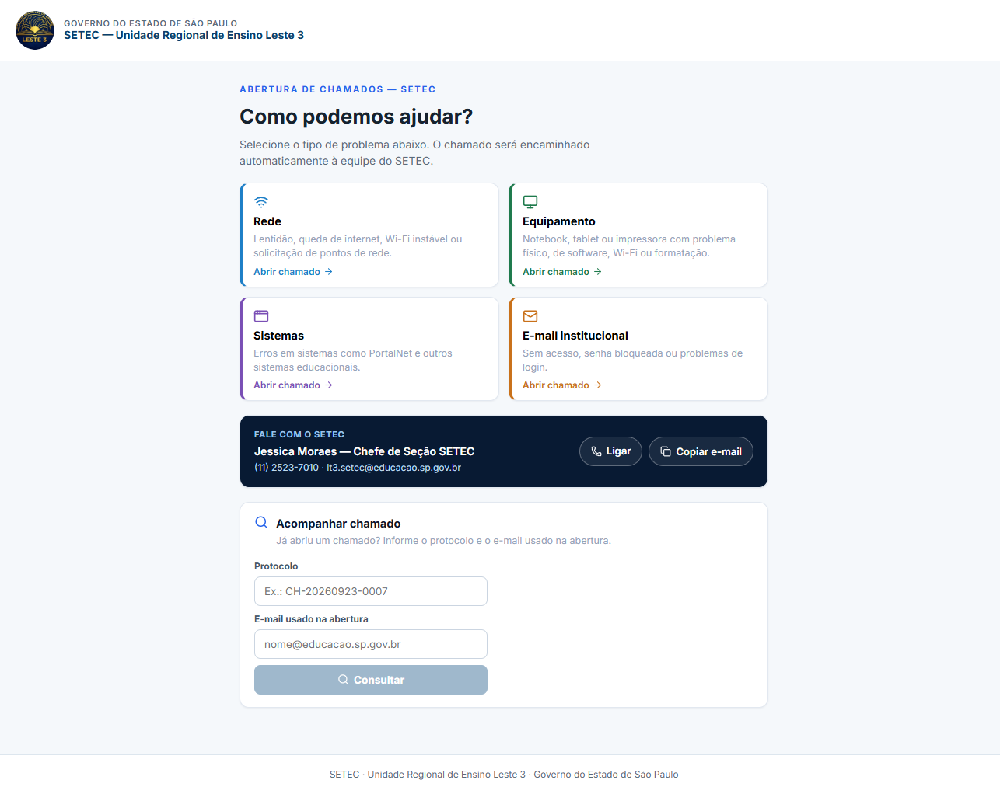
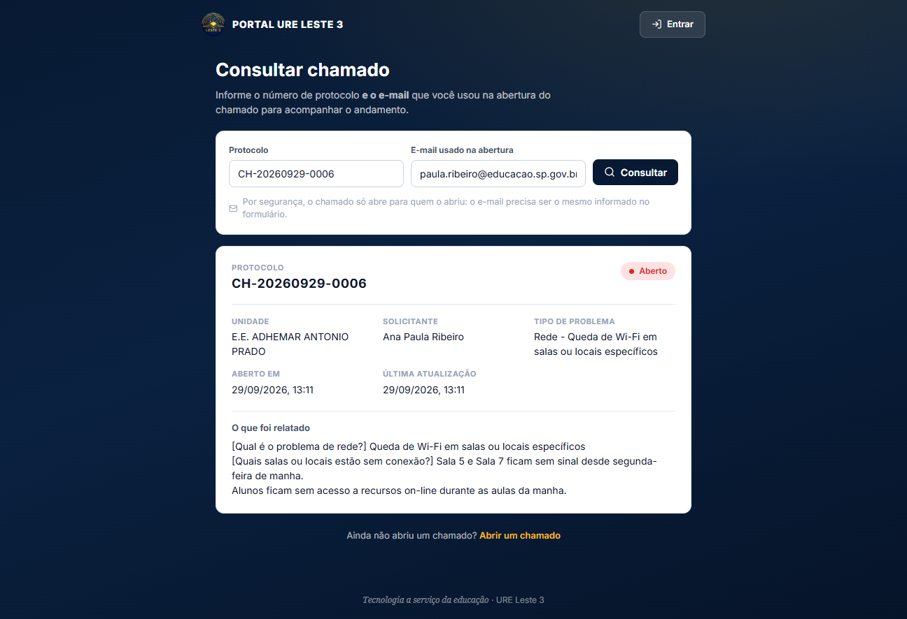

# 01 · Visão geral

## O que é

O **Portal URE Leste 3** é o ponto de entrada único da equipe de tecnologia
(SETEC) da **Unidade Regional de Ensino Leste 3** para:

1. **Abrir e acompanhar chamados de suporte** das escolas da região.
2. **Controlar o inventário de equipamentos** de cada unidade escolar.

Antes do portal, esses dois assuntos viviam em sistemas separados (um para
chamados, outro para equipamentos, o "SCE"). O portal é a camada de
apresentação que unifica os dois — **sem reescrever os backends**: ele consome
as duas APIs existentes e reconcilia os dados no frontend.

---

## Quem usa

| Público | Precisa de login? | O que faz |
|---|---|---|
| **Professores, coordinators, diretores, AOE** | Não | Abre chamados, acompanha por protocolo + e-mail, manda elogios/sugestões |
| **Dirigente / gestão regional** | Não | Consulta os painéis públicos de transparência |
| **Qualquer pessoa** | Não | Lê tutoriais por link público, acessa o painel geral |
| **Visualizador** | Sim | Acompanha dados da própria unidade, sem apagar nada |
| **Gestor** | Sim | Como o Visualizador, e ainda gerencia os usuários da escola |
| **Técnico** | Sim | Atende chamados, cuida de equipamentos e manutenção de um conjunto de escolas |
| **Administrador (matriz)** | Sim | Acesso total: configurações, formulário, encaminhamento, usuários, logs |

---

## Módulos do sistema

### 1. Abertura de chamado (público)

Wizard de 4 etapas em `/chamado/novo`:

```
Escolher categoria  →  Responder perguntas  →  Identificação  →  Protocolo
```

- As **categorias e perguntas** não são fixas no código: são configuráveis pelo
  ADMIN em *Configurações → Formulário de chamados*.
- Suporta **perguntas condicionais** (uma pergunta só aparece se a resposta de
  outra for exatamente um certo rótulo), **alertas** que informam ou bloqueiam o
  fluxo, e **seleção em cascata de equipamento** (categoria → marca → modelo).
- Ao enviar, o sistema gera o **protocolo** `CH-AAAAMMDD-NNNN` e devolve na tela
  o par **protocolo + e-mail**, que é a credencial de consulta.



### 2. Consulta de chamado (público)

Em `/consulta`, o chamado só abre com **protocolo + o e-mail usado na abertura**.
O protocolo sozinho é sequencial e adivinhável, por isso o e-mail é obrigatório —
essa decisão de segurança está detalhada em
[Autenticação e permissões](./04-autenticacao-e-permissoes.md#a-consulta-pública-por-protocolo).

A tela mostra status, descrição, resposta da equipe, **conversa com a matriz**
(perguntas e respostas) e, quando o chamado é concluído, a **avaliação de 1 a 5
estrelas**.



### 3. Gestão de chamados (interno)

Em `/chamados`: lista com KPIs, filtros, seleção múltipla e ações em lote.
O modelo de controle muda conforme o perfil:

- **Matriz (ADMIN/TÉCNICO)** — encaminhar para técnico, mudar status, perguntar à
  escola, registrar histórico, excluir, agir em lote.
- **Escola (GESTOR/VISUALIZADOR)** — responder quando a matriz pergunta e
  concluir o chamado. Nada mais.

### 4. Inventário de equipamentos (interno)

Em `/equipamentos`: cadastro, edição, remoção, filtro, drilldown por categoria
em gráfico, exportação CSV/PDF e **histórico de alterações** por equipamento.

Existe uma regra importante: escolas **irmãs** que dividem o mesmo prédio
(`papelUnidade: FILHA`) compartilham o painel de equipamentos do grupo, mas
**não podem cadastrar, editar ou remover** — só visualizar. O bloqueio existe
nos dois lados (botão escondido no portal **e** bloqueio no SCE).

### 5. Unidades escolares (matriz)

Em `/unidades`: uma linha **por prédio**, juntando o cadastro oficial de escolas
(com o backend de chamados) e o resumo de equipamentos (do SCE). Inclui
exportação CSV e o status do inventário de cada grupo.

### 6. Painéis públicos

- `/matriz` — **Painel geral de chamados**: 6 KPIs, gráficos de situação e
  urgência, resolvidos por técnico e os 10 últimos chamados.
- `/dirigente` — **Painel do dirigente**: mesma fonte, com recorte por categoria
  e por unidade, pensado para leitura executiva.


### 7. Base de conhecimento (tutoriais)

Em `/tutoriais`: guias e passo a passo escritos pela equipe. Cada tutorial tem
um **link público** (`/tutorial/:id`) que abre **sem login**, para compartilhar
com professores que não têm acesso ao portal.

### 8. Elogios, sugestões e avaliações

- `/elogios` (público) — qualquer pessoa manda um elogio ou sugestão.
- `/feedback` (matriz) — leitura consolidada, com média de avaliação e
  distribuição das notas. Fica no menu como **Elogios e Avaliações**.

### 9. Configurações (ADMIN)

Sete abas: catálogo de equipamentos, status do parque, formulário de chamados,
encaminhamento automático, **logs do sistema**, **integrações** e **testes de
acesso**. Detalhes em [Rotas e telas](./05-rotas-e-telas.md#configurações).

### 10. Relatórios

Seis relatórios. Dois são gerados pelo SCE (inventário CSV e equipamentos por
status em PDF); os outros quatro são montados no próprio navegador a partir de
chamados e equipamentos, em CSV com separador `;` e BOM UTF-8 (abre direto no
Excel em pt-BR).

---

## Conceitos que atravessam o sistema

| Conceito | O que é |
|---|---|
| **Protocolo** | Identificador público do chamado: `CH-AAAAMMDD-NNNN`, sequencial por dia. |
| **Filial** | Campo de texto com o nome da unidade do usuário. Para **Técnico** guarda uma lista separada por vírgula (`"E.E. A, E.E. B"`). |
| **Grupo / irma** | Escolas que dividem o mesmo prédio. A **MÃE** administra; a **FILHA** só visualiza equipamentos. |
| **Nível** | `ADMIN` \| `TECNICO` \| `GESTOR` \| `VISUALIZADOR`. Define menus, rotas e botões. |
| **Papel de unidade** | `MAE` \| `FILHA`. Vem do backend de chamados, já calculado no login. |
| **Matriz** | Quem pertence à região (URE Leste 3), não a uma escola específica. |
| **Categoria do formulário** | Agrupamento do chamado (`rede`, `equipamento`, `sistemas`, `email`). É a chave que liga o chamado à regra de encaminhamento automático. |
| **SSO** | O SCE valida o mesmo JWT emitido pelo backend de chamados usando um segredo compartilhado. Um login só. |

---

## O que o portal **não** faz (limites conhecidos)

- **Não é fonte de verdade de nada.** Toda persistência é dos dois backends. Se
  um deles cai, os módulos dele ficam indisponíveis — o portal não tem cache
  próprio nem banco.
- **Não tem e-mail próprio.** Quem envia notificações é o backend de chamados.
- **Não tem gestão de senha do usuário final.** O ADMIN gera uma senha
  temporária; o usuário define a definitiva no primeiro acesso.
- **Não tem auditoria própria.** O histórico do chamado é texto livre mantido
  pelo backend de chamados; o SCE tem uma tabela de auditoria própria.
- **Não tem testes automatizados nem lint configurados.** A garantia de
  qualidade é `vue-tsc` no build + revisão manual.

Esses e outros riscos estão detalhados em
[Tratamento de erros](./09-tratamento-de-erros.md).

---

Ver também: [Arquitetura](./02-arquitetura.md) ·
[Estrutura do projeto](./03-estrutura-do-projeto.md)
