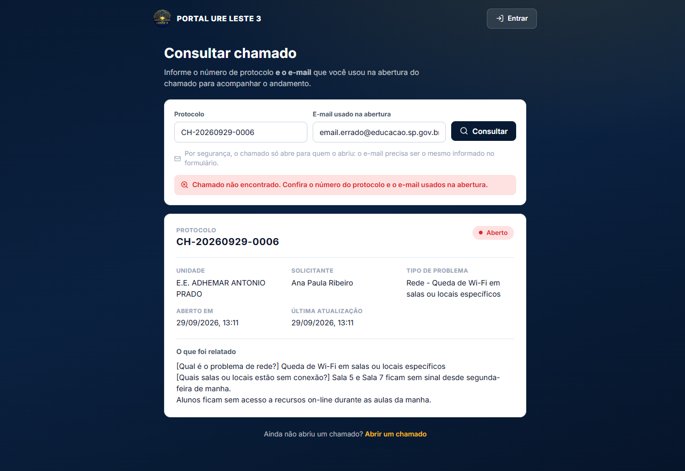

# 04 · Autenticação e permissões

## Modelo de identidade

Quem emite a identidade é o **backend de chamados**. O SCE aceita o mesmo token
por SSO, mas **nunca confia no nível que vem no JWT** — ele resolve o usuário
no banco dele e lê o nível de lá. Isso evita que um token adulterado elevate
privilégio no inventário.

```
POST /api/auth/login
{
  "email": "usuario@educacao.sp.gov.br",
  "senha": "..."
}
→ 200
Set-Cookie: refreshToken=<jwt>; HttpOnly; Secure; SameSite=None; Max-Age=604800

{
  "accessToken": "eyJhbGciOiJIUzI1NiIs…",   // expira em 15 min · só em memória
  "user": {
    "id": "…", "email": "…", "nome": "…",
    "nivel": "ADMIN",                        // ADMIN | TECNICO | GESTOR | VISUALIZADOR
    "filial": "URE Leste 3",
    "grupo": "E.E. A / E.E. B",              // nome composto do prédio
    "papelUnidade": "MAE",                   // MAE | FILHA
    "status": "ATIVO",
    "primeiroLogin": false
  },
  "primeiroLogin": false
}
```

> ⚠️ **O `refreshToken` não vem no corpo.** Ele viaja apenas no cookie
> `httpOnly` — o JavaScript não consegue lê-lo, e é por isso que o campo não
> existe mais no tipo `LoginResponse`. Quem renova a sessão é
> `POST /auth/refresh` com **corpo vazio**; o navegador anexa o cookie sozinho.

### Como a sessão sobrevive a um F5

Não sobrevive — ela é **reconstruída**. Não há token em disco:

```
F5 → initialize() → POST /auth/refresh (cookie) → 200? novo accessToken + user
                                                     → 401? deslogado (esperado)
```

O guard espera `initialize()` terminar antes de decidir qualquer redirecionamento,
então não existe "flash" de tela protegida para quem não tem sessão.

> **Consequência do `primeiroLogin`:** quando vem `true`, o usuário é
> **obrigado** a criar uma senha definitiva antes de qualquer outra tela. Não
> é um aviso — o guard do router bloqueia a navegação.

---

## Primeiro acesso: código gerado pela Matriz

A tela `/login` tem **três etapas** em vez de duas. A pessoa digita o e-mail, o
portal descobre se aquela conta ainda está em primeiro acesso e, se estiver,
pede o código de 6 dígitos que a **Matriz entregou** antes de deixar criar a
senha.

```
                     ADMIN: cria o usuário na tela Usuários
                                  │
                                  ▼
                    POST /usuarios  →  { codigoPrimeiroAcesso: "367834" }
                    (o código JÁ SAI pronto na criação)
                                  │
                      Matriz repassa o código à pessoa
                                  │
┌─────────────────────────────────┘
│
▼  ① e-mail ──POST /auth/verificar-email──▶ primeiroAcesso?
                                              │
                        não ──────────────────┴────────────── sim
                        │                                       │
                   etapa ③ senha             etapa ② código
                   (login normal)            (digita os 6 dígitos)
                                                        │
                                                        ▼
                                        POST /auth/primeiro-acesso/confirmar
                                        (→ token de uso único, 10 min)
                                                        │
                                                        ▼
                                        POST /auth/primeiro-acesso/definir-senha
                                        (token + senha ×2)
                                                        │
                                                        ▼
                                          accessToken + cookie de refresh
                                          → entra direto no painel
```

A consulta do e-mail acontece **enquanto a pessoa digita** (debounce de 600 ms).
Se a rota falhar por rede ou rate limit, a tela **não tranca ninguém** — segue
para a etapa de senha e tenta o login normal.

> ⚠️ **Não há envio de e-mail em lugar nenhum.** O e-mail do usuário é apenas
> identificador/login. O código é gerado pelo ADMIN e repassado em mão (no
> mesmo modal que antes mostrava a senha temporária) ou pela ação **"Novo
> código de acesso"** na lista de usuários. Isso foi uma decisão conscious: a
> rede de ensino ainda não tem serviço de e-mail transacional configurado
> (`BREVO_API_KEY` está ausente), então um fluxo que dependesse de e-mail
> simplesmente não funcionaria.

### Por que um código, e não só o e-mail

O SCE antigo (`sce/server.js`, `/api/definir-senha`) aceitava **e-mail +
senha nova, sem prova nenhuma**. Quem soubesse o endereço institucional de um
colega que ainda não tinha senha definia a senha e tomava a conta. A própria
equipe do SCE registrou isso em `sce/security.js`:

> *"O SCE aceitava 6 caracteres sem nenhuma exigência de classe, e
> `/api/definir-senha` não exigia prova de posse do e-mail."*

Aqui o e-mail é só o **identificador de login**. Sem o código, a senha não é
criada: o `/definir-senha` exige o `token` emitido pelo `/confirmar`, e um teste
trava exatamente isso — `POST /definir-senha` sem token devolve `401` e **não
grava nada**.

### As três defesas

| Defesa | Como funciona |
|---|---|
| **Prova de autorização** | O código só sai para o ADMIN, que decide a quem entregar. O `/definir-senha` exige o token do `/confirmar`; e-mail + senha sozinhos não criam nada. |
| **E-mail não é erro de resposta** | E-mail **inexistente**, **inativo** e **que já tem senha** respondem **o mesmo objeto**: `{ existe: true, primeiroAcesso: false, ativo: true }`. Só quem está em primeiro acesso diverge. Sem isso, a tela virava um enumerador de quem usa o portal. |
| **Rate limit** | `/confirmar` + `/definir-senha` = 20 por 15 min; `/verificar-email` = 20 por min. Mais o limite de **5 tentativas por código**, dentro do serviço. |

### Validade e consumo

| Objeto | Validade | Regra |
|---|---|---|
| Código de 6 dígitos | 24 h | 5 tentativas erradas e ele é apagado; gerar outro **invalida** o anterior |
| Token de criação | 10 min | Uso único — a senha criada consome o token |

Só o **SHA-256** do código vai para o banco (`codigoHash`), nunca o código em
claro — o mesmo cuidado do `refreshTokenHash`. Gerar um código novo apaga o
anterior e revoga o token dele: duas janelas abertas ao mesmo tempo não podem
acontecer.

> **Por que 24 h e não 10 min:** o código não chega por e-mail, ele é anotado
> ouditado em papel e entregue em mão. 10 minutos forçaria a Matriz a gerar
> outro a cada tentativa.

### Se a pessoa não tiver o código

1. A Matriz abre **Usuários** e usa **"Novo código de acesso"** na linha do
   usuário. Um novo código sai, o anterior morre.
2. Quem já tem senha definitiva não precisa de código nenhum: a tela do código
   oferece **"Já tenho senha — entrar"**, e o login normal segue igual.
3. O backend diz ao ADMIN **por que** não gerou (`usuário inexistente`,
   `inativo`, ou `já definiu a senha`) — para ele não ficar adivinhando.

### O que substituiu a senha temporária

A senha temporária **saiu de cena**. Antes, o ADMIN gerava uma senha e a
entregava; a pessoa entrava com ela e era obrigada a trocá-la. Agora o ADMIN
entrega um **código**, e a pessoa cria a senha dela direto — ela nunca chega a
possuir uma senha que não escolheu.

`POST /auth/admin/gerar-senha-temporaria` foi removido e virou
`POST /auth/admin/gerar-codigo-primeiro-acesso` (mesma restrição: só ADMIN).

> O `TrocarSenhaView` continua existindo, mas agora **só** para troca voluntária
> (o menu "Trocar senha"). O caminho de primeiro acesso é o novo, porque
> primeiroLogin vira `false` já no `/definir-senha`.

### O token é o mesmo para o portal e para o SCE

O `/definir-senha` monta a sessão com a **mesma função** do `/login`
(`buildLoginResponse`), então emite o mesmo JWT: `type: "access"` + `email`.
É exatamente o que o SCE valida em `trySsoSession` (`sce/server.js`) para
aceitar a sessão por SSO. Ou seja: quem cria a senha pelo portal entra nos
equipamentos sem fazer login de novo.

Tabela nova (2 tabelas, ambas cascade de `Usuario`):
`CodigoPrimeiroAcesso` e `CodigoConfirmado`.

---

## Os quatro níveis

| Nível | Rótulo na interface | Alcance | O que pode fazer |
|---|---|---|---|
| `ADMIN` | Administrador | URE Leste 3 (matriz) | Tudo: configurações, usuários de qualquer perfil, equ exclução de chamado, encaminhamento, logs |
| `TECNICO` | Técnico | Lista de escolas da sua `filial` | Chamados (encaminhar, status, histórico, lote), equipamentos, manutenção, unidades |
| `GESTOR` | Gestor | Uma escola | Gerir chamados e equipamentos da unidade, gerir usuários da escola (até 2, sempre Visualizador), concluir chamados |
| `VISUALIZADOR` | Visualizador | Uma escola | Igual ao Gestor, **sem** apagar usuários nem equipamentos |

### Detalhe do Técnico

A `filial` do Técnico guarda uma **lista separada por vírgula**:

```
filial = "E.E. HUMBERTO DANTAS, E.E. HUMBERTO BAPTISTELLI"
```

O backend usa isso para filtrar chamados e equipamentos: o técnico vê os dois
setores. No *Cadastro de usuários*, cada unidade é uma linha com um `select`, e
o botão "Adicionar mais uma unidade" cria a próxima linha.

---

## Escopo de tipos de chamado (eixo independente do nível)

Além do nível e da unidade, um Técnico ou Administrador pode ser **restrito a
certos tipos de chamado**, de **qualquer escola**. É o caso de quem é da área de
sistemas e não da rede: a pessoa atende PortalNet e SEI, e não deve ver — nem
receber — chamado de equipamento.

No *Cadastro de usuários* é um bloco de checkboxes que só aparece para
Administradores, em cadastro de Técnico ou Administrador.

### Como é gravado

```
escopoTipos = ["sistemas::PortalNet", "sistemas::SEI"]
```

O formato é `<chaveDaCategoria>::<rótulo da 1ª opção>`. **Lista vazia = sem
restrição**: o usuário se comporta exatamente como antes, respeitando só a
`filial`. É por isso que o campo é uma lista com default vazio e não uma coluna
nullable — nenhuma conta já cadastrada muda de comportamento.

### A unidade deixa de valer

Com escopo preenchido, a trava de unidade é **substituída** pela trava de tipo:

| | Sem escopo | Com escopo |
|---|---|---|
| Quais chamados aparecem | Das escolas do `filial` | De **todas** as escolas, só dos tipos marcados |
| Encaminhamento automático | Técnico da unidade | O especialista do tipo **tem prioridade** |
| Filtro "Categoria" da tela | Todas as categorias | Só as que têm tipo liberado |
| Menu lateral | Completo | Só *Painel* e *Chamados* |
| Sino de notificações | Broadcast da unidade | Só o que é pessoal (ele é o responsável) |

O campo **Unidade** continua obrigatório no cadastro — o SCE e o inventário
dependem dele. O texto do bloco de escopo avisa que, com escopo marcado, a
unidade deixa de valer **para chamados**.

### Como o tipo é comparado

O backend monta o `tipo` do chamado como `"<Categoria> - <1ª resposta>"`, então
o escopo casa pelo texto com duas alternativas: igualdade, ou `startsWith` com
`" - "` à frente. O separador é o que impede o erro clássico — sem ele, o escopo
`sistemas::SEI` também traria um tipo `"Sistemas - SEIplus"`.

Categorias cuja **primeira pergunta não é de opções** (o "E-mail institucional"
começa pelo CIE da escola) não geram tipo: para elas a checkbox marca a
**categoria inteira** (`email::`).

### Quem pode definir

Só o **Administrador**. Para o Gestor o campo é descartado, igual já acontece
com `nivel` e `filial`. Definir escopo é um *aumento* de acesso — quem o tem vê
chamado de qualquer escola.

### Renomear a opção no formulário

A chave da categoria sobrevive a renomear a categoria; o **rótulo da opção não**.
Renomear "PortalNet" em *Configurações → Formulário* deixa o escopo órfão, e o
`PATCH /usuarios` passa a recusar o valor com 400 informando o tipo inválido —
melhor do que o usuário voltar a ver tudo achando que ainda estava restrito.

---

## Papel de unidade: MÃE e FILHA

Independente do nível, uma escola tem um papel dentro do grupo que divide o
prédio:

```
"grupo": "E.E. CESAR DONATO CALABREZ / E.E. ISAAC SCHRAIBER FILHO"
papelUnidade: "MAE"     ← administra o painel de equipamentos compartilhado
papelUnidade: "FILHA"   ← só visualiza
```

O papel é **calculado pelo backend** no login e no `/auth/me`, a partir do
catálogo de escolas. Não vem do banco como coluna.

### O que a FILHA perde

| Operação | MÃE | FILHA |
|---|---|---|
| Ver equipamentos do grupo | ✅ | ✅ |
| Filtrar, buscar, exportar CSV/PDF | ✅ | ✅ |
| Cadastrar equipamento | ✅ | ❌ |
| Editar equipamento | ✅ | ❌ |
| Remover equipamento | ✅ | ❌ |

No portal isso aparece de três formas:

1. **Botão "Adicionar equipamento" some.**
2. **"Editar" e "Remover" somem** do menu de ações da linha.
3. **Banner azul na tela** (`EquipamentosView`, com `--blue-soft`):

   > Equipamentos compartilhados com **{irma}** — sua unidade tem acesso
   > **somente de visualização**. Para cadastrar, alterar ou remover, fale com a
   > escola principal.

O bloqueio é **duplo**: a interface esconde o botão **e** o SCE rejeita a
escrita (devolvendo `success: false` com a mensagem de somente-leitura). Se
alguém chamar a API direto, não consegue escrever.

Na prática, as duas metades da regra lado a lado: a escola **FILHA** em
[`35-equipamentos-escola-filha-somente-leitura.png`](./screenshots/35-equipamentos-escola-filha-somente-leitura.png)
e a **MÃE** do mesmo grupo em
[`36-equipamentos-escola-mae-com-edicao.png`](./screenshots/36-equipamentos-escola-mae-com-edicao.png).

> ⚠️ **Importante:** a regra de FILHA vale **só para equipamentos**. Em
> *Chamados*, Gestor e Visualizador têm exatamente o mesmo comportamento
> (responder + concluir).

---

## Guarda de rota

`router/index.ts` roda um `beforeEach` global com quatro regras, nesta ordem:

```ts
1. auth ainda não inicializada?  → await auth.initialize()

2. rota NÃO é pública e não estou autenticado
      → { name: 'login', query: { redirect: to.fullPath } }
      (depois de entrar, o usuário volta exatamente para onde tentava ir)

3. estou em /login e já estou autenticado
      → { name: 'painel' }

4. auth.mustChangePassword e a rota não é /trocar-senha
      → { name: 'trocar-senha' }
      (vale inclusive para rotas públicas!)

5. rota tem meta.roles e meu nível não está na lista
      → { name: 'painel' }        ← sem mensagem de erro

6. document.title = `${meta.title} · PORTAL URE LESTE 3`
```

Três decisões importantes:

- **Não existe tela de "403".** Quem tenta acessar algo fora do perfil é
  redirecionado ao painel, silenciosamente. O menu já escondeu o caminho, então
  a situação não deveria acontecer — e se acontecer, o redirecionamento é
  mais limpo que uma tela de erro.
- **A troca de senha obrigatória vence até as rotas públicas.** Um usuário de
  primeiro acesso não consegue nem abrir o formulário de chamado até definir a
  senha. É intencional: garante que todo mundo no sistema tem senha definitiva.
- **Rota desconhecida → painel.** O catch-all `/:pathMatch(.*)*` redireciona
  para `/painel`. Não existe página 404.

---

## Tabela de rotas e quem acessa

| Rota | Tela | Público | Perfis |
|---|---|---|---|
| `/login` | Login | ✅ | todos |
| `/trocar-senha` | Trocar senha | — | todos os autenticados |
| `/chamado/novo` | Novo chamado | ✅ | qualquer pessoa |
| `/consulta` | Consultar chamado | ✅ | qualquer pessoa |
| `/elogios` | Elogios e sugestões | ✅ | qualquer pessoa |
| `/tutorial/:id` | Tutorial público | ✅ | qualquer pessoa |
| `/matriz` | Painel geral | ✅ | qualquer pessoa |
| `/dirigente` | Painel do dirigente | ✅ | qualquer pessoa |
| `/painel` | Painel | — | todos os autenticados |
| `/equipamentos` | Equipamentos | — | todos os autenticados |
| `/manutencao` | Manutenção | — | todos os autenticados |
| `/chamados` | Chamados | — | todos os autenticados |
| `/tutoriais` | Tutoriais | — | todos os autenticados |
| `/tutoriais/:id` | Detalhe do tutorial | — | leitura: todos · escrita: ADMIN |
| `/feedback` | Elogios e avaliações | — | **ADMIN, TECNICO** |
| `/unidades` | Unidades escolares | — | **ADMIN, TECNICO** |
| `/relatorios` | Relatórios | — | todos os autenticados |
| `/usuarios` | Usuários | — | **ADMIN, GESTOR** |
| `/configuracoes` | Configurações | — | **ADMIN** |

> **Sobre `/relatorios`:** a rota não tem `meta.roles`, então aparece no menu
> para todo mundo. Mas dois dos seis relatórios exigem ADMIN no backend. Para
> quem não é, a tela mostra um aviso no topo e o botão responde com
> "Seu perfil não tem permissão para gerar este relatório (disponível apenas
> para ADMIN)."

> **Sobre `/usuarios` e o GESTOR.** As três camadas: a rota e o item de menu
> abrem para `ADMIN` e `GESTOR`; a tela trava *Perfil* e *Unidade escolar* e
> esconde *Novo código de acesso*; e o backend restringe tudo à própria filial,
> ignorando o `?filial=` da consulta e qualquer `nivel`/`filial` do corpo. São
> **2 vagas** por unidade, com aviso na tela — os prints
> [`42`](./screenshots/42-usuarios-gestor-unidade.png),
> [`43`](./screenshots/43-usuarios-gestor-modal-perfil-travado.png) e
> [`44`](./screenshots/44-usuarios-gestor-limite-atingido.png) mostram os três
> estados.

---

## O menu lateral

`AppSidebar.vue` filtra os itens no `computed visibleItems`:

```ts
adminOnly:    só nivel === 'ADMIN'              → Configurações
gestorTambem: ['ADMIN','GESTOR']                → Usuários
matrizOnly:   ['ADMIN','TECNICO']               → Unidades Escolares
(sem flag):   todos os autenticados             → o resto
```

O filtro é **cosmético** — quem digitar a URL ainda é barrado pelo guard. Mas o
guard não serve para tudo: ele verifica **nível**, não **papel de unidade**. Por
isso o botão "Remover equipamento" usa `podeGerenciar` (nível + papel) e não
apenas `meta.roles`.

---

## Troca de senha

Duas funções numa tela só (`TrocarSenhaView`), com rótulos que se adaptam:

| Situação | Título | Dica |
|---|---|---|
| Primeiro acesso | **Defina sua senha** | "Este é seu primeiro acesso. Crie uma senha definitiva para continuar." |
| Troca voluntária | **Trocar senha** | "Após trocar a senha, você precisará entrar novamente." |

Política de senha, avaliada **na ordem**, primeira falha vence:

1. Mínimo de 8 caracteres
2. Pelo menos uma letra maiúscula
3. Pelo menos uma letra minúscula
4. Pelo menos um número
5. Pelo menos um caractere especial

Ao salvar, o backend **derruba todas as sessões** do usuário e o portal limpa o
estado em memória e volta para `/login`. É por isso que o botão diz
"Salvar nova senha" e não "Salvar" — você vai precisar entrar de novo.

> ⚠️ Esta tela é **só troca voluntária** (menu "Trocar senha"). O primeiro
> acesso tem caminho próprio — e melhor: a pessoa digita e-mail + código, e já
> entra com a senha que escolheu, sem passar por cá.

---

## Simulação de perfil (apenas em desenvolvimento)

> ⚠️ **A aba "Testes de acesso" só existe em desenvolvimento.** A flag
> `auth.simulacaoAtivavel` vem de `import.meta.env.DEV`; em produção o botão
> some e `simularComo()` é um no-op. O motivo está no próprio código: o
> simulador troca o `nivel` apenas na memória, então em produção levava o
> usuário a crer que trocar perfil era uma função real de autorização — e
> escondia bugs de menu/guard, em que o item sumia para o perfil errado sem o
> backend recusar a requisição.

Em *Configurações → Testes de acesso* (só em `npm run dev`), o ADMIN pode
"abrir o portal como" outro perfil. O que acontece:

- Troca **apenas** `user.nivel` na memória.
- Menus, guards de rota e botões passam a se comportar como aquele perfil.
- O JWT e a sessão continuam sendo os reais — **o backend segue autorizando pelo
  perfil verdadeiro**, então um botão que aparece na simulação pode falhar com
  403 ao ser clicado. Isso é proposital: mostra onde a UI e o backend divergem.
- Um **banner amarelo** aparece no topo de toda página autenticada:

  > Simulando perfil **Técnico** — apenas a interface muda; suas credenciais
  > continuam as mesmas.  `[ Encerrar simulação ]`

- **Some ao recarregar a página** (não é persistido).
- A **escola continua real**: se você é FILHA e simula ADMIN, continua somente
  leitura em equipamentos. O papel de unidade não é simulado.
- Mesmo após um refresh de token automático, a simulação continua ativa.

---

## A consulta pública por protocolo

Esta é a parte mais sensível do sistema, porque é **público**.

### O problema

O protocolo é `CH-AAAAMMDD-NNNN` — sequencial por dia. Significa que os
protocolos do dia são **previsíveis**: `CH-20260929-0001`, `-0002`… Dá para
chutar e abrir o chamado de qualquer pessoa.

### A solução

A consulta exige o **par protocolo + e-mail**, e o e-mail precisa ser
**exatamente** o informado na abertura (comparação sem diferenciar maiúsculas,
ignorando espaços):

```
GET /api/chamados/protocolo/CH-20260929-0006?email=paula.ribeiro@educacao.sp.gov.br
```

Por isso o e-mail became **obrigatório já na abertura** do chamado — não é um
campo decorativo, é a segunda credencial.

### As três defesas

| Defesa | Como funciona |
|---|---|
| **Par obrigatório** | Sem os dois, nada abre. O backend exige e-mail válido por schema. |
| **Resposta ambígua** | Protocolo inexistente, chamado excluído, chamado sem e-mail gravado e e-mail errado **todos** devolvem exatamente a mesma resposta: `404` com *"Chamado não encontrado. Confira o protocolo e o e-mail informados."* Não dá para enumerar. |
| **Rate limit** | 20 requisições por minuto nas rotas `/chamados/protocolo`. |

A tela de consulta reproduz a ambiguidade do lado do cliente também:



> Note que a mensagem **não diz qual dos dois campos estava errado** — é
> proposital. Dizer "e-mail incorreto" já confirmaria que o protocolo existe.

### A avaliação usa o mesmo par

Para avaliar um chamado (nota 1 a 5), a pessoa precisa informar **protocolo +
e-mail de novo**. Sem isso, qualquer um com o protocolo poderia avaliar o
chamado dos outros. Regras:

- Só chamado com status `RESOLVIDO`.
- Uma avaliação por chamado — a segunda tentativa devolve `409`.
- Comentário opcional, limitado a 1000 caracteres.

### Deep link seguro

O botão "Acompanhar chamado" da tela de sucesso já leva o par:

```
/consulta?protocolo=CH-20260929-0006&email=paula.ribeiro@educacao.sp.gov.br
```

O e-mail validado é guardado em memória e reaproveitado no polling e no envio da
avaliação — a pessoa não precisa redigitar.

---

Ver também: [Backends e endpoints](./06-backends-e-endpoints.md) ·
[Rotas e telas](./05-rotas-e-telas.md) ·
[Tratamento de erros](./09-tratamento-de-erros.md)
