# 05 · Rotas e telas

## Mapa geral

```
                    ┌────────────────────────────────────┐
                    │          PÚBLICO (sem login)        │
   qualquer pessoa  │  /chamado/novo   /consulta           │
        ──────────► │  /elogios         /tutorial/:id      │
                    │  /matriz          /dirigente         │
                    │  /login           /trocar-senha       │
                    └──────────────────┬─────────────────┘
                                       │ autentica
                    ┌──────────────────▼─────────────────┐
                    │      AppShell (sidebar + topbar)     │
                    │                                      │
                    │  /painel          Painel             │
                    │  /equipamentos    Equipamentos       │
                    │  /manutencao      Manutenção         │
                    │  /chamados        Chamados           │
   autenticados ───►│  /tutoriais       Tutoriais          │
                    │  /tutoriais/:id   Tutorial (detalhe) │
                    │  /unidades        Unidades           │
                    │  /relatorios      Relatórios         │
                    │  /usuarios        Usuários      ADM/GST│
                    │  /configuracoes   Configurações   ADM │
                    │  /feedback        Elogios/Aval.   ADM │
                    └────────────────────────────────────┘
```

Rota desconhecida → redireciona para `/painel`.

---

# Área pública

Duas "molduras" diferentes, de propósito:

- **`PublicoLayout`** — fundo branco, cabeçalho branco com marca + botão
  "Entrar", rodapé. Usada em `/consulta`, `/elogios`, `/tutorial/:id`, `/matriz`,
  `/dirigente`.
- **Shell legado** (`NovoChamadoView`) — fundo claro, cabeçalho
  "GOVERNO DO ESTADO DE SÃO PAULO / SETEC — Unidade Regional de Ensino Leste 3".
  Mantido porque o formulário de chamado é usado por toda a rede e o visual
  claro é mais familiar para quem preenche documentos.

---

## `/chamado/novo` — Novo chamado

Wizard de 4 etapas. É a tela mais complexa do sistema.

**Fluxo:** `Escolher categoria → Responder perguntas → Identificação → Protocolo`

### Etapa 0 · Categorias

Grade de cartões, um por categoria ativa do formulário, cada um com:

- Ícone derivado da chave: `rede`→Wifi, `equipamento`→Monitor,
  `sistemas`→AppWindow, `email`→Mail, senão HelpCircle
- Borda esquerda na cor da categoria
- Nome, descrição e o link "Abrir chamado →"

Abaixo, dois cartões fixos:

- **Fale com o SETEC** — nome, telefone e e-mail, com botões "Ligar"
  (`tel:`) e "Copiar e-mail".
- **Acompanhar chamado** — campos de protocolo e e-mail que levam para
  `/consulta` com os dois já preenchidos. É o caminho de quem **já** abriu
  chamado e não quer perder tempo procurando o número.

Se não houver categoria cadastrada, aparece *"Nenhuma categoria disponível no
momento."*. Se a carga falhar, aparece o erro com botão **Tentar novamente**.

### Etapa 1 · Perguntas

As perguntas vêm do banco (`/formulario/publico`), são filtradas por `ativa` e
ordenadas por `ordem`.

**Três tipos de resposta:**

| Tipo | Renderização | Validação mínima |
|---|---|---|
| `OPCOES` | Lista de cartões de rádio | Escolha obrigatória |
| `TEXTO` | Input de uma linha | ≥ 2 caracteres |
| `TEXTO_LONGO` | Textarea | ≥ 2 caracteres |

**"Outro (descrever)"** — toda pergunta de `OPCOES` ganha automaticamente uma
opção extra, "Outro (descrever)", que abre um campo de texto embaixo. É o
escape para tudo que não estiver nas opções — e por isso nunca pode ser
apagado pelo ADMIN.

**Perguntas condicionais** — cada pergunta pode ter `dependeDePerguntaId` +
`dependeDeOpcao`. Ela só aparece se a pergunta-pai tiver **exatamente** aquele
rótulo selecionado. Exemplo real: escolher *"Queda de Wi-Fi em salas ou locais
específicos"* faz aparecer *"Quais salas ou locais estão sem conexão?"*.

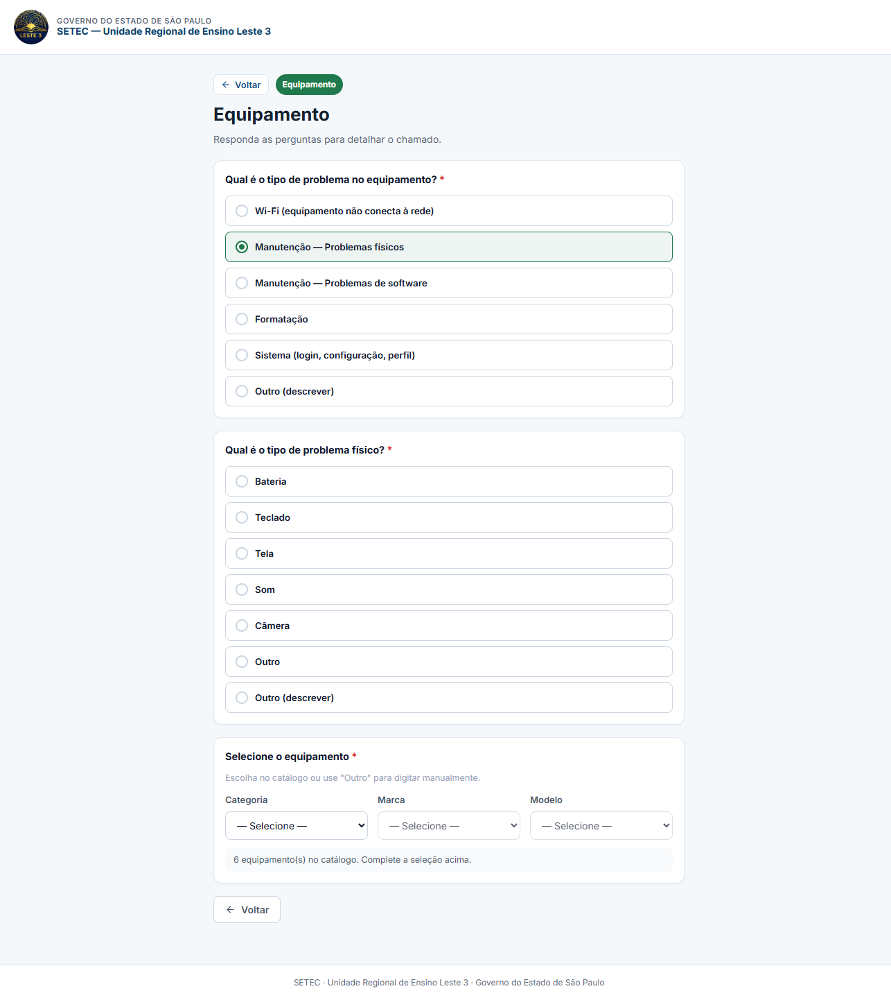

> ⚠️ O casamento é pelo **texto do rótulo**, não por um id. Se o ADMIN renomear a
> opção "Queda de Wi-Fi…" depois de criar a pergunta dependente, a pergunta
> condicional **some silenciosamente**. Ao editar opções, confira se alguma
> pergunta depende delas.

**Alertas por opção** — cada opção pode ter um alerta com:

| Campo | Efeito |
|---|---|
| `texto` | Mensagem exibida abaixo da pergunta |
| `tipo` | `info` (azul) ou `aviso` (laranja) |
| `linkRotulo` / `linkUrl` | Botão que abre em nova aba |
| `encerra` | **Bloqueia** o avanço — só o botão "Voltar ao início" funciona |
| `exigeAnexo` | Torna o anexo obrigatório na etapa de identificação |

O botão **Continuar** fica oculto (não desabilitado) enquanto o formulário está
incompleto, e ele **não avança** se alguma opção escolhida tiver `encerra`.

**Cascata de equipamento** — só na categoria `equipamento`:

```
Categoria  →  Marca  →  Modelo
```

Cada select oferece "Outro (digitar manualmente)", que troca o select por um
campo de texto. O bloco só fica habilitado quando a etapa anterior está
preenchida, e mostra "Carregando equipamentos…" enquanto busca.

### Etapa 2 · Identificação

`resumo-pills` no topo resume as respostas (categoria + respostas), para a pessoa
conferir antes de enviar.

| Campo | Tipo | Obrigatório |
|---|---|---|
| Nome completo | texto | ✅ |
| Cargo/Função | select (7 opções¹) | ✅ |
| E-mail institucional | e-mail | ✅ |
| Escola/Unidade | select (catálogo do backend) | ✅ |
| Descrição adicional | textarea | ❌ |
| Urgência | Baixa / Média / Alta | ✅ |
| Anexo | arquivo (`image/*`, `.pdf`) | condicional² |

¹ Diretor, Vice-diretor, Coordenador, Gerente de Organização Escolar, Agente de
Organização Escolar, Professor, Estagiário (Proati)
² Obrigatório quando alguma opção escolhida tem `exigeAnexo`. Limite:
**10 MB**.

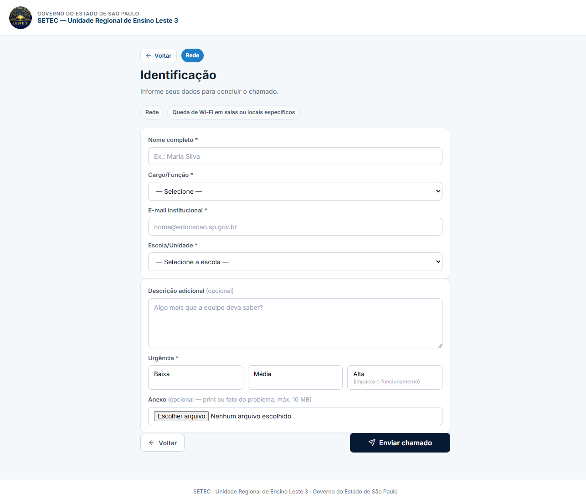

**Validação** — todas as mensagens aparecem em vermelho abaixo do campo e a
tela rola até o topo:

| Campo | Mensagem |
|---|---|
| nome vazio | `Informe o nome completo.` |
| cargo vazio | `Selecione o cargo/função.` |
| e-mail vazio | `Informe o e-mail institucional.` |
| e-mail inválido | `Informe um e-mail válido (ex.: nome@educacao.sp.gov.br).` |
| escola vazia | `Selecione a escola/unidade.` |
| urgência vazia | `Selecione a urgência.` |
| anexo exigido e ausente | `Anexe ao menos uma foto (obrigatório para esta opção).` |
| descrição composta vazia | `Descreva brevemente o problema.` |

> A validação da descrição olha a **descrição composta** (respostas +
> equipamento + texto livre), não só o campo de texto livre. Alguém que respondeu
> 4 perguntas e não escreveu nada no campo livre **não** recebe erro.

### Etapa 3 · Protocolo

Tela de sucesso com o protocolo em destaque, botão "Copiar" e duas ações:
**Acompanhar chamado** (já com protocolo + e-mail) e **Abrir outro chamado**
(que **zera tudo**, não só a navegação).

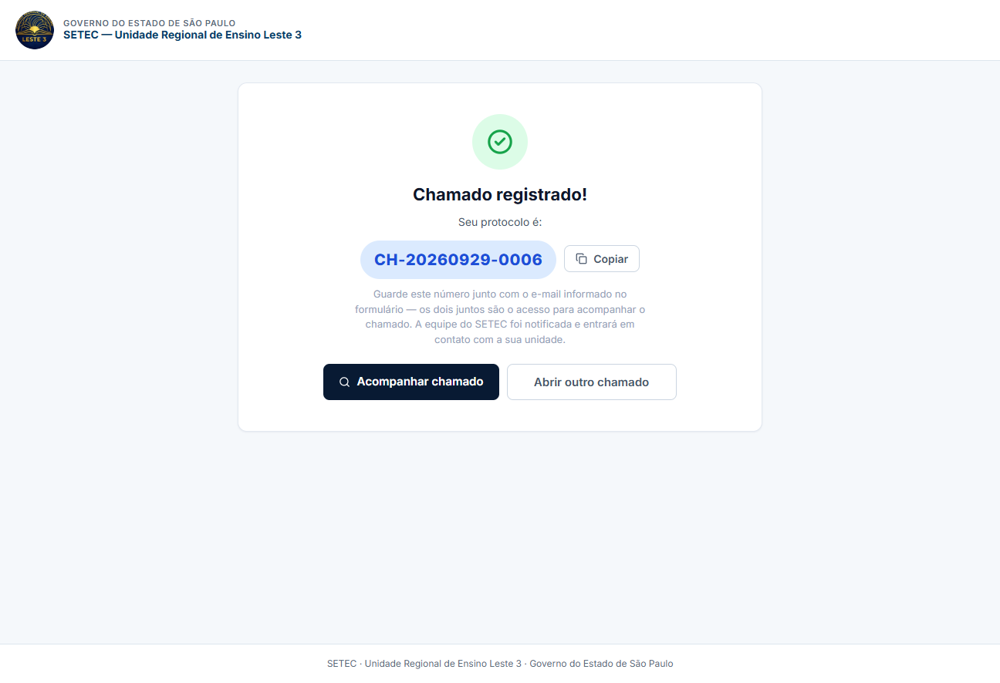

### O que é enviado

```jsonc
{
  "unidade":        "E.E. ADHEMAR ANTONIO PRADO",
  "solicitante":    "Ana Paula Ribeiro",
  "funcao":         "Coordenador",
  "tipo":           "Rede - Queda de Wi-Fi em salas ou locais específicos",  // máx 100 chars
  "categoriaChave": "rede",        // ← chave que dispara o encaminhamento automático
  "descricao":      "[Qual é o problema de rede?] Queda de Wi-Fi em salas…\n[Quais salas…] Sala 5 e Sala 7…\nAlunos ficam sem acesso…",
  "urgencia":       "Média",
  "email":          "paula.ribeiro@educacao.sp.gov.br",
  "anexoBase64":    "…",           // sem o prefixo data:…;base64,
  "anexoNome":      "print.png",
  "anexoTipo":      "image/png"
}
```

O `categoriaChave` é o campo mais importante: é ele que permite ao backend
encaminhar automaticamente o chamado para o técnico da unidade. O `tipo` é texto
legível e **não** deve ser usado para lógica.

---

## `/consulta` — Consultar chamado

- Campos de protocolo e e-mail, com dica de segurança explicando por que os
  dois são necessários.
- Se a URL já vier com `?protocolo=…&email=…`, preenche e **consulta sozinho**.
- Resultado: protocolo, status, unidade, solicitante, tipo, datas, link do
  anexo, **O que foi relatado** (a descrição composta, com as quebras de linha
  preservadas) e, se houver, **Resposta da equipe**.
- **Conversa com a matriz**: lista de mensagens. Perguntas da matriz em
  amarelo (`Matriz (SETEC)`), respostas da escola em azul (`Você — {nome}`).
  Quando a última mensagem é uma pergunta da matriz e o status é
  `COMUNICADO`, aparece um aviso pedindo resposta pela unidade.
- **Polling de 30 s** para acompanhar sem recarregar. Falha de polling é
  silenciosa e **não** limpa o formulário de avaliação em andamento.
- Se o chamado estiver `RESOLVIDO`, aparece a avaliação de 1 a 5 estrelas com
  comentário opcional.

---

## `/elogios` — Elogios e sugestões

Dois botões grandes alternam o tipo (Elogio / Sugestão). Nome e unidade são
opcionais; a mensagem é obrigatória (mínimo 3 caracteres). O *placeholder* do
textarea muda conforme o tipo. Após enviar, a tela é substituída por uma
confirmação com opção "Enviar outra mensagem".

Sem link de entrada no portal — o acesso é por URL ou link compartilhado.

---

## `/tutorial/:id` — Tutorial público

Leitura de um tutorial sem login. Mostra categoria, título, subtítulo, autor,
data, contador de visualizações, conteúdo (texto com quebras preservadas) e
anexos. Botão "Copiar link" no topo.

Estados: carregando / não encontrado (404) / falha de rede.

---

## `/matriz` — Painel geral de chamados

Painel de transparência, público, atualizado sozinho a cada 30 s.

- 6 KPIs: total, abertos, em atendimento, aguardando escola, resolvidos, alta
  prioridade.
- 2 gráficos de rosca: por situação e por urgência.
- 1 gráfico de barras: resolvidos por técnico.
- Tabela com os **10 últimos chamados** (protocolo, urgência, unidade, tipo,
  status, data) e botão "Abrir um chamado".

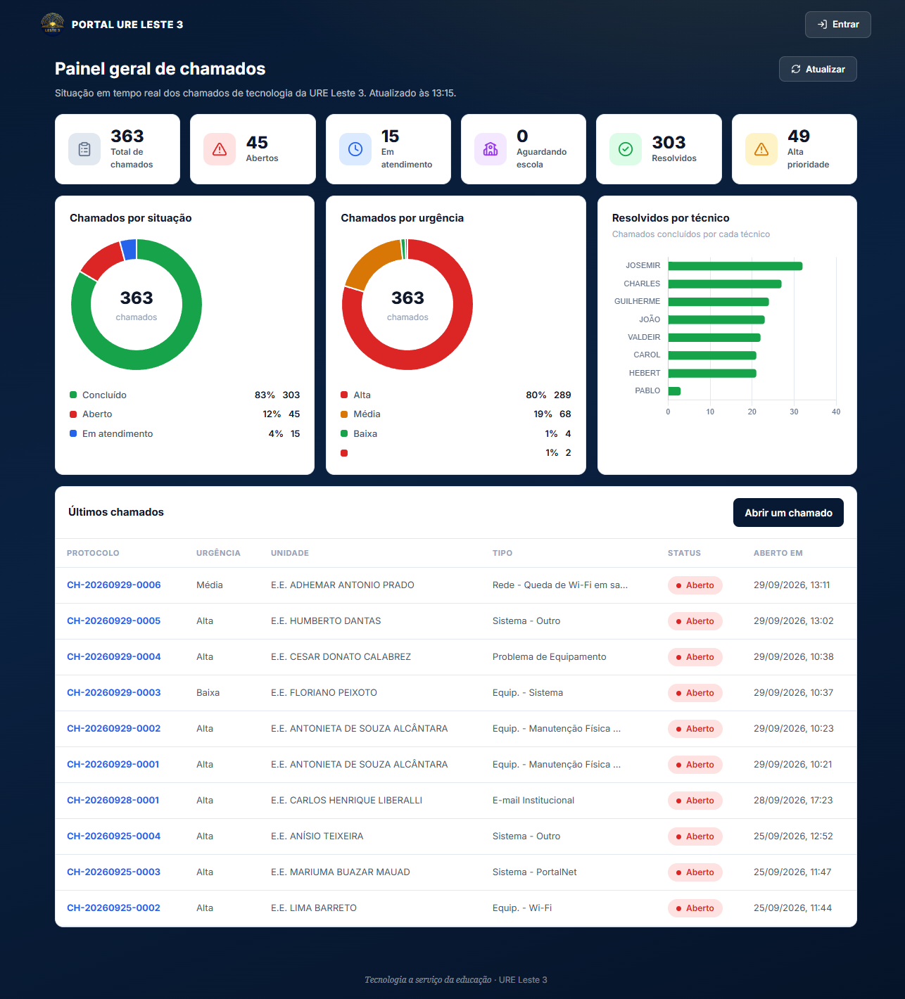

---

## `/dirigente` — Painel do dirigente

Mesma fonte de dados, recorte executivo:

- 5 KPIs: total, aguardando atendimento (em aberto), em atendimento, **taxa de
  resolução** e **nota de atendimento** (média das avaliações, ex.: `4,3/5`;
  `—` quando ninguém avaliou).
- Gráfico de barras **empilhado** por categoria (empilhado por situação).
- Rosca de situação geral.
- Chamados por unidade (top 10) e resolvidos por técnico.
- Lista dos últimos chamados em formato de timeline.

Atualiza a cada 60 s.

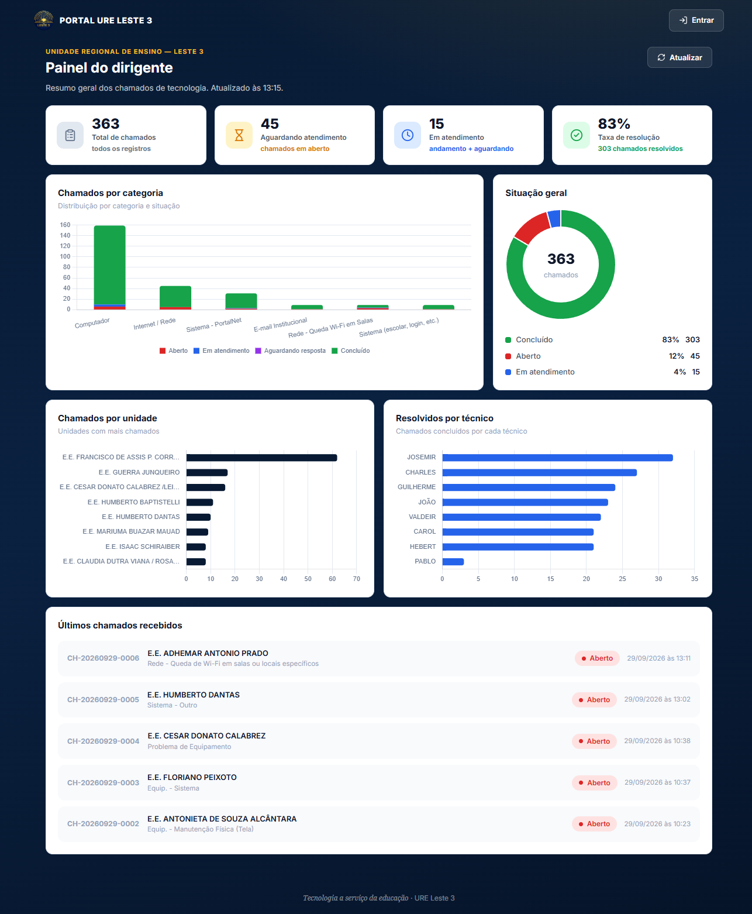

---

## `/login` — Entrar

Cartão centralizado com brasão, e-mail e senha. Erro de credencial aparece em
vermelho abaixo dos campos. Sem link de "esqueci a senha" — a recuperação é
feita pelo ADMIN, que gera uma senha temporária.

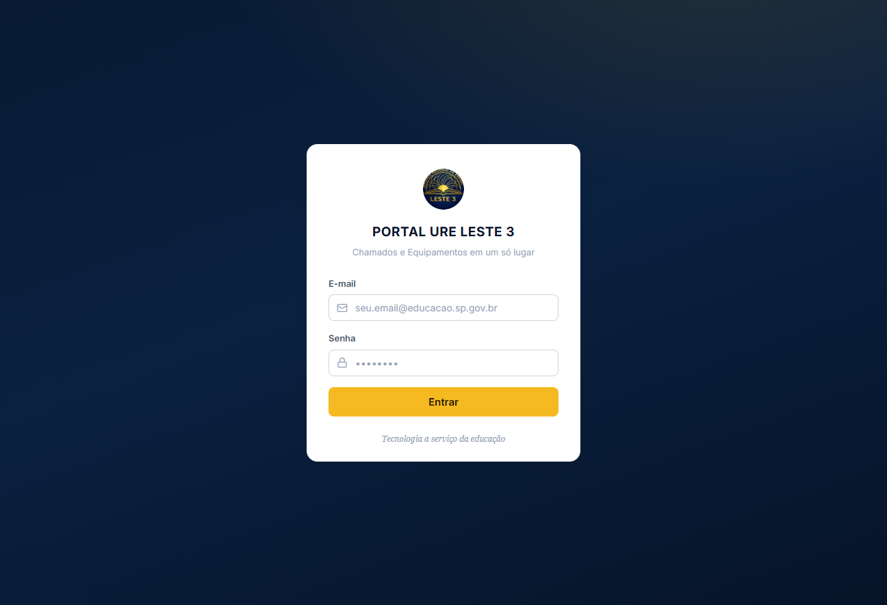

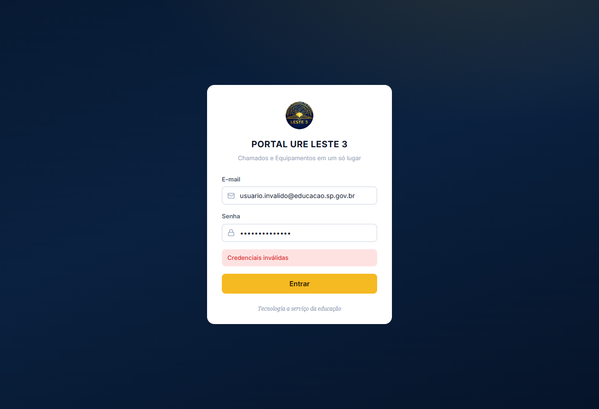

---

# Área autenticada

Todas as telas internas vivem dentro do `AppShell`: sidebar fixa à esquerda
(240 px), topbar com título + breadcrumb + relógio + sino + menu do usuário, e
conteúdo com 24 px de padding.

Em telas de até 900 px a sidebar vira drawer (hamburger na topbar) e o relógio
esconde.

---

## `/painel` — Painel

A tela que **muda mais** conforme o perfil. Ela se divide em "topo comum",
"meio variável" e "base variável".

### Topo comum (todos os perfis)

5 KPIs de equipamento: cadastrados, disponíveis, em manutenção, quebrados,
extraviados — os quatro últimos com percentual.

2 gráficos de rosca: **Equipamentos por Categoria** e **Status dos
Equipamentos**.

### Somente escola (GESTOR / VISUALIZADOR)

- **Banner azul "+ Abrir Novo Chamado"** — abre o formulário público em nova
  aba (link externo, não rota interna).
- **Card "Acesso Rápido"** com quatro atalhos:
  - Meus Equipamentos → `/equipamentos`
  - Meus Chamados → `/chamados`
  - Guias e Manuais → `/tutoriais`
  - Fale com o SEINTEC → `mailto:lt3.seintec@educacao.sp.gov.br`

  Os três primeiros usam `RouterLink` (navegação sem recarregar a SPA); o
  e-mail abre nova aba.

### Perfil escola (metade inferior)

Duas tabelas lado a lado:

- **Equipamentos** — modelo, patrimônio, status (5 primeiras linhas) + "Ver
  todos"
- **Chamados** — protocolo, data, tipo, status (5 primeiros) + "Ver todos"

### Perfil matriz (ADMIN / TÉCNICO / VISUALIZADOR, metade inferior)

3 cards auxiliares (só ADMIN e TÉCNICO):

- Unidades com equipamentos
- Modelos cadastrados
- Avaliação de atendimento (rosca de 1 a 5 com a média no centro)

Depois, um card de **filtros** (unidade, categoria, status, busca) e a tabela
completa de equipamentos com paginação.

> **Caso especial do VISUALIZADOR:** ele recebe o topo de escola (banner +
> Acesso Rápido) **e** a base de matriz (filtros + tabela completa), mas **não**
> os cards auxiliares. É uma decisão deliberada de produto: o Visualizador é um
> Gestor sem poderes de escrita, mas precisa consultar o parque inteiro.

Atualização: 60 s.

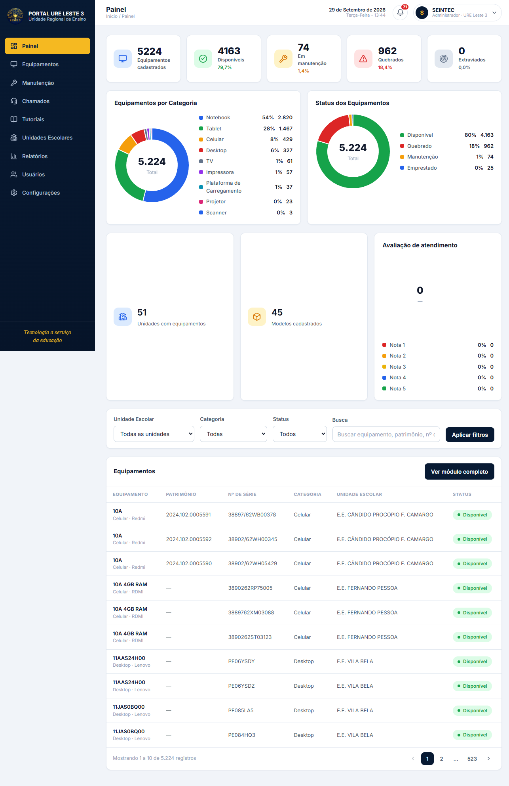

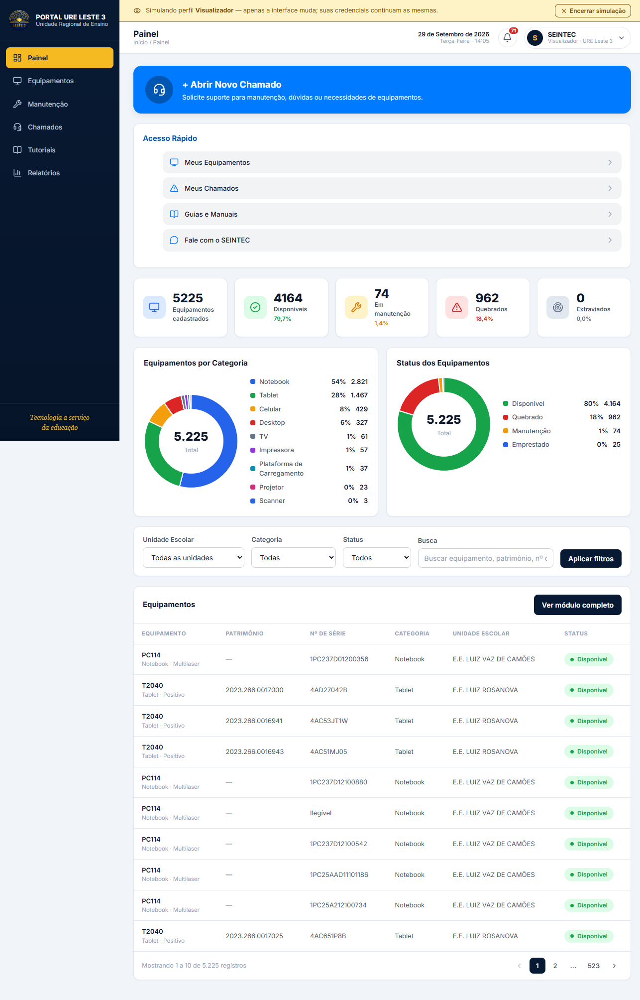

No segundo print repare no **banner amarelo** de simulação, no menu que perdeu
*Unidades Escolares* / *Usuários* / *Configurações* e no bloco **Acesso
Rápido**, que só aparece para escola.

---

## `/chamados` — Chamados

A tela mais densa do sistema.

**5 KPIs** (total, abertos, em atendimento, aguardando resposta, concluídos).

**Chips de filtro rápido** — grupo 1 (seleção única): Todos, Abertos, Em
atendimento, Aguardando resposta, Concluídos. Grupo 2 (alternadores): **Só
urgentes**, **PortalNet**.

**Toolbar** — busca por unidade, select de status, select de urgência, select de
**categoria**, select de **técnico**, botão "Filtrar" e link dourado "Abrir
chamado" (nova aba).

> Os dois selects novos carregam as opções uma vez, no `onMounted`, e
> **toleram falha**: se a chamada cair, ficam só com "Todos" e a listagem
> continua funcionando — filtro é conveniência, não requisito para ver os
> chamados. O de categoria vem de `/formulario/publico` (o mesmo catálogo da
> tela de abertura, já que é de graça e sem exigir login); o de técnico, de
> `/chamados/filtros/tecnicos`.
>
> O de categoria tem uma opção a mais, **"Fora das categorias"**: no banco, 364
> dos 366 chamados foram abertos antes do formulário ficar dinâmico e não têm
> vínculo com nenhuma categoria do catálogo. Sem essa opção, 92% do histórico
> ficaria fora de qualquer escolha.

> **Os dois se limpam entre si.** Marcar o chip "PortalNet" desmarca o select de
> categoria, e escolher uma categoria desmarca o chip. Ambos filtram por
> categoria — deixá-los marcados somaria um filtro que ninguém vê na tela.

**Barra de lote** (só ADMIN/TÉCNICO) — aparece quando há seleção: "N chamado(s)
selecionado(s)", select de novo status e botão "Aplicar em lote".

**Tabela** — `Protocolo | Data | Unidade Escolar | Equipamento / Tipo |
Descrição | Status | Ações` (+ checkbox na primeira coluna para matriz).
Clicar na descrição expande/recua o texto (funciona bem no celular).

**Modal de detalhe** com:
- Grade de identificação (unidade, solicitante, cargo, e-mail, tipo, urgência,
  responsável, status)
- **Descrição**
- **Histórico** — timeline vertical, rolada para o fim ao abrir, com cor por
  tipo de evento (verde para concluído, azul para mudança de status, roxo para
  resposta/comunicado)
- **Perguntas e respostas** — a conversa com a escola

**Ações da matriz:**

| Ação | Detalhe |
|---|---|
| **Encaminhar para técnico** | Select com "Técnico da unidade (sugerido)" + optgroups "Atende esta unidade" (sempre primeiro) e "Outros técnicos". A lista é a **escala de atendimento** (`utils/tecnicos.ts`) e muda conforme a categoria do chamado. Observação opcional (500 chars) vai para o histórico. Se já houver responsável, pede confirmação. |
| **Alterar status** | Select + "Salvar". Ao escolher *Aguardando resposta*, **exige** escrever a pergunta para a escola. Ao escolher *Concluído*, pede a descrição da resolução. |
| **Adicionar resposta ao histórico** | Input + "Registrar" |
| **Excluir** | Só ADMIN (restrição do backend) |

**Ações da escola:**

| Ação | Quando |
|---|---|
| **Responder chamado** | Só quando o status é *Aguardando resposta*. Aceita anexos. |
| **Concluir chamado** | Sempre que não estiver resolvido. |

**Limites de anexo:** 5 MB por arquivo, 5 arquivos por mensagem, `image/*` e
`.pdf`. Anexos de pergunta/resposta **expiram em 7 dias** (o backend apaga).

**Deep link:** `?chamado=<id>` abre o modal direto. É assim que as notificações
do sino trazem o usuário até o chamado certo.

Atualização: 30 s.

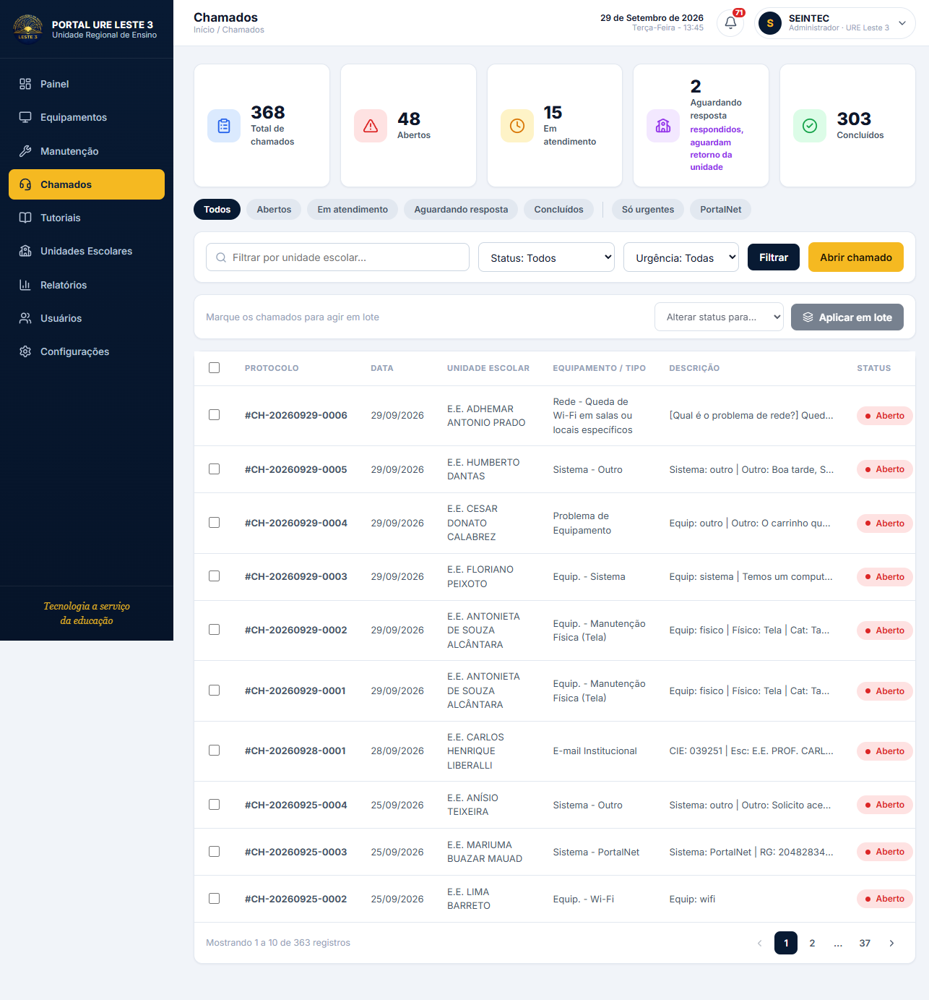

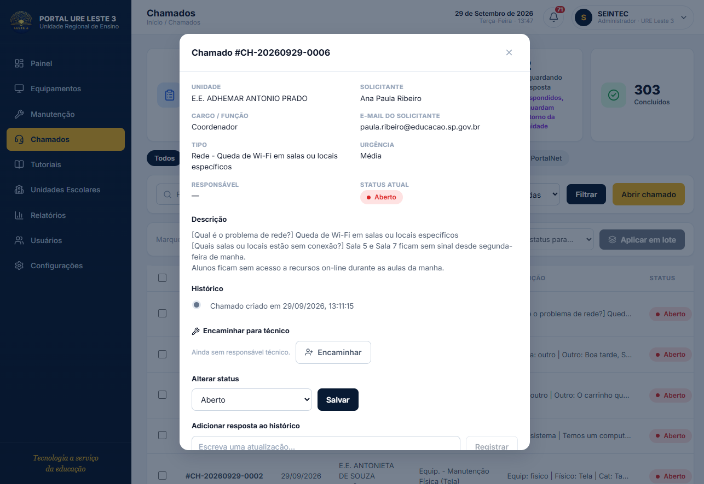

---

## `/equipamentos` — Equipamentos

**Toolbar** — busca, "Adicionar equipamento" (some para FILHA), select de
status, select de unidade (some para Gestor), botões CSV e PDF.

**Gráfico de categorias** com drilldown: clicar numa fatia abre a lista de
modelos daquela categoria dentro do próprio card.

**Tabela** — `Equipamento | Patrimônio | Nº de Série | Categoria | Modelo |
Unidade Escolar | Status | Ações`.

**Ações da linha:** "Ver detalhes e histórico" (sempre), "Editar" (exceto
FILHA), "Remover" (só ADMIN/GESTOR não-FILHA).

**Modal de detalhe** — identificação completa + **Histórico de alterações**
(campo, valor antigo → novo, autor, data).

**Modal de cadastro/edição** — categoria, marca, modelo (com autocompletar a
partir do catálogo), unidade, patrimônio, número de série, status e campos
específicos por status (chamado de manutenção, descrição de quebrado,
justificativa de verificação, boletim de ocorrência, responsável, observações).

Atualização: 30 s.

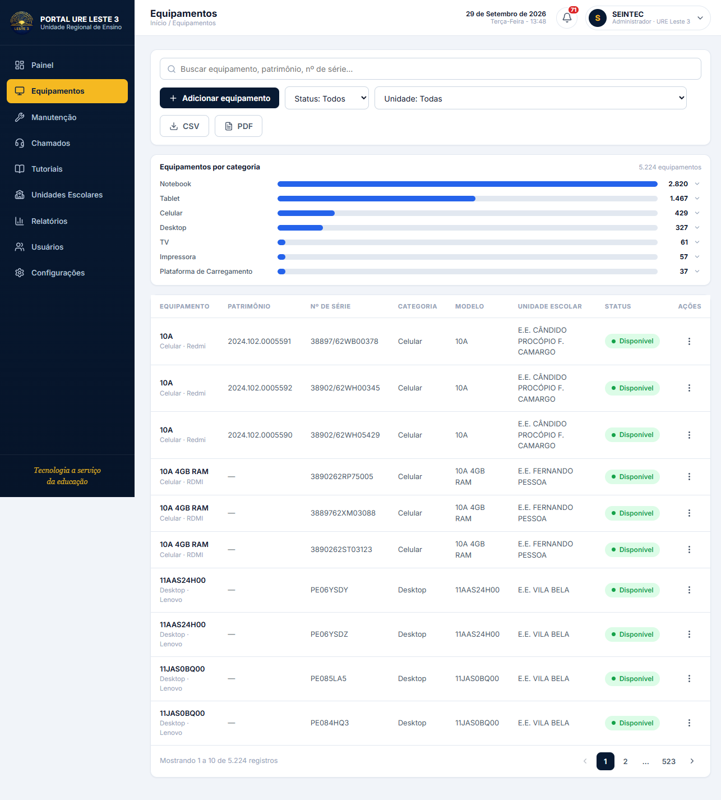

---

## `/manutencao` — Manutenção

Somente leitura. Lista equipamentos **em manutenção** com: data da última
atualização, equipamento, patrimônio, unidade, descrição, status.

**4 KPIs** — em manutenção, pendente, em atendimento, concluídos.
**Filtro** por status de manutenção. Cada linha abre o histórico de alterações.

Atualização: 60 s.

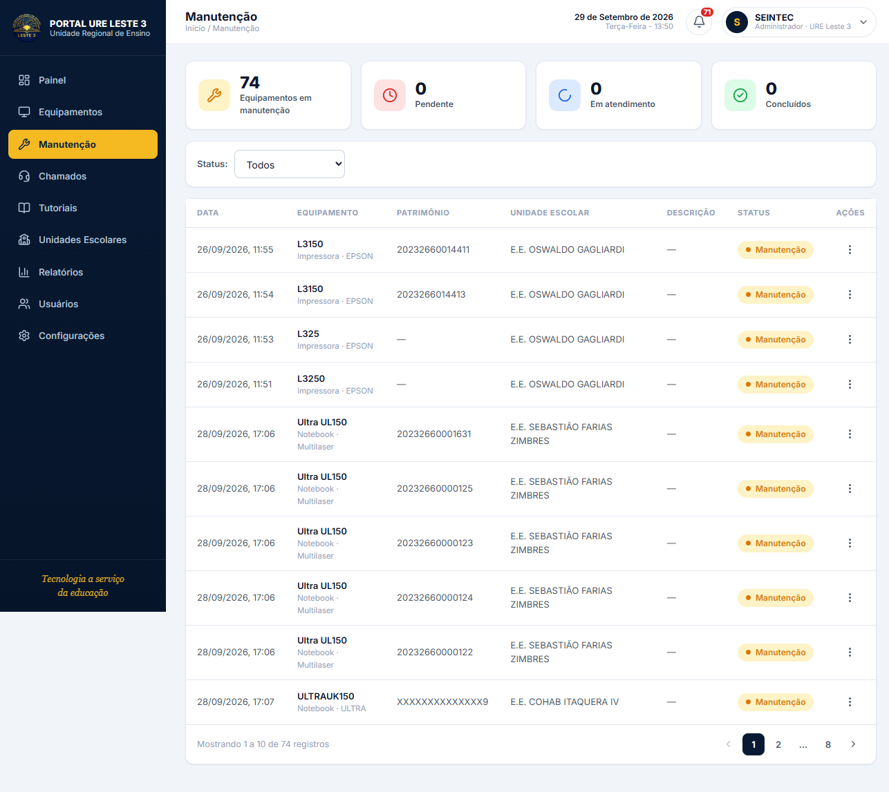

---

## `/unidades` — Unidades escolares *(ADMIN, TÉCNICO)*

Uma linha **por prédio** (não por escola). Escolas irmãs viram uma linha só,
com a indicação "divide o prédio com {irma}".

**4 KPIs** — total de unidades, com equipamentos, sem equipamentos, chamados
abertos.

**Filtros** — busca, com/sem equipamentos, técnico, status do inventário.
Todos locais (o conjunto já está em memória).

**Tabela** — `Código | Unidade Escolar | Técnico | Inventário | Cadastrou
equip.? | Total Equip. | Disponíveis | Manutenção | Quebrados | Extraviados |
Chamados`.

Exporta CSV com 14 colunas.

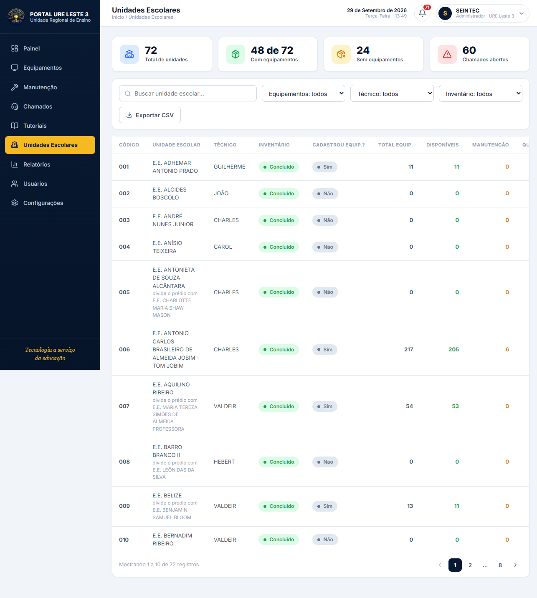

> **Nota de contagem.** Esta tela conta **prédios**; o painel de equipamentos
> conta **nomes de unidade**. Os dois totais divergem legitimamente. Um bug
> anterior (contagem dupla quando a mãe e a filha compartilham o nome de grupo)
> inflava o total em ~66%; foi corrigido com um `Set` de deduplicação.

Sem polling — os dados são carregados uma vez ao abrir.

---

## `/tutoriais` e `/tutoriais/:id` — Tutoriais

Grade de cartões com busca (debounce de 300 ms), filtro por categoria em chips e
paginação de 12. Cada cartão tem botão "Link público" que copia
`{origin}/tutorial/{id}`.

ADMIN additionally vê: "Novo tutorial", "Gerenciar categorias" (criar/excluir),
"Editar" e "Excluir" no detalhe.

Ler um tutorial **incrementa o contador de visualizações** no backend — não é
uma leitura idempotente, é de propósito.

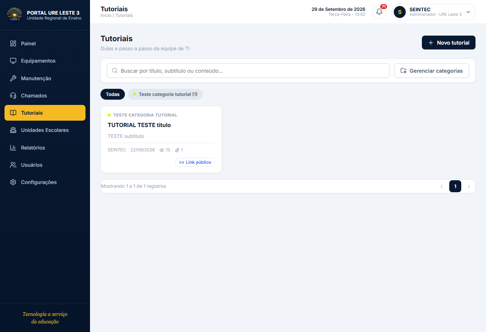

---

## `/relatorios` — Relatórios

Seis cartões, um botão "Gerar" cada:

| Relatório | Formato | Origem |
|---|---|---|
| Inventário de Equipamentos | CSV | SCE (`/exportar-csv`) |
| Equipamentos por Status | PDF | SCE (`/exportar-pdf`) |
| Chamados Abertos e em Atendimento | CSV | Montado no navegador |
| Chamados Concluídos | CSV | Montado no navegador |
| Inventário por Unidade | CSV | Montado no navegador |
| Manutenções | CSV | Montado no navegador |

Os CSVs gerados no navegador usam separador `;`, CRLF e BOM UTF-8 — abrem
corretamente no Excel em português.

Para gerar o CSV de chamados, a tela **pagina o backend em lotes de 100** até
trazer tudo, e só então filtra localmente.

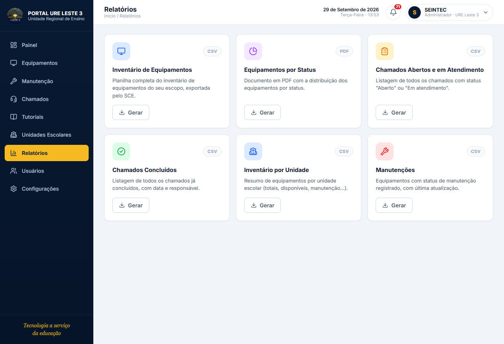

---

## `/usuarios` — Usuários *(ADMIN, GESTOR)*

Tabela com busca, filtro por status e paginação de 10. Ações por linha: "Editar",
"Nova senha temporária" (só ADMIN) e "Desativar".

O botão "Desativar" **não apaga** — marca como `INATIVO` e derruba as sessões. O
usuário não pode se desativar a si mesmo.

**Modal de cadastro/edição:**

- **ADMIN** pode criar qualquer perfil. Para **Técnico**, o campo vira uma lista
  de unidades (uma linha por select, com "Adicionar mais uma unidade").
- **GESTOR** só pode criar **Visualizador** da própria escola, e o perfil vem
  travado. O backend limita a 2 usuários ativos por unidade.

Ao criar, um segundo modal mostra a **senha temporária** com botão "Copiar
senha".

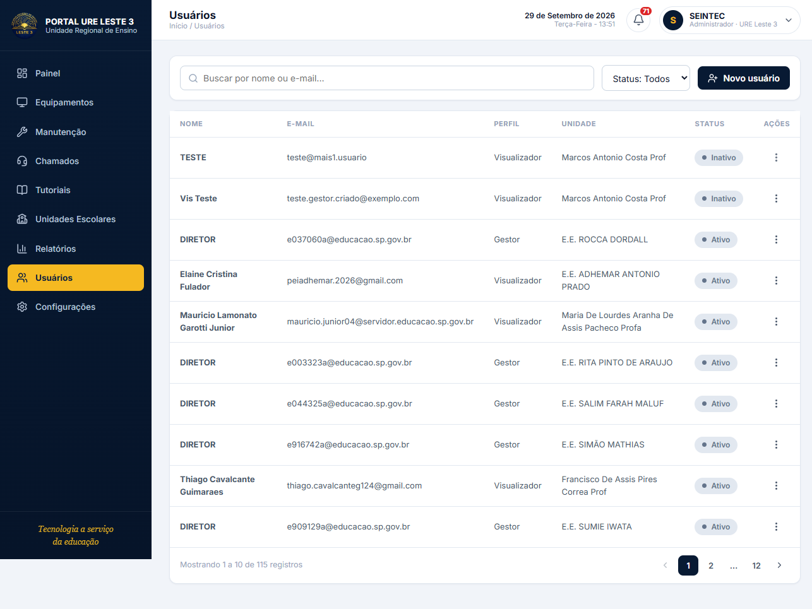

---

## `/feedback` — Elogios e avaliações *(matriz: ADMIN/TÉCNICO)*

Somente leitura, em três blocos:

1. **4 KPIs** — média (`x.x/5`), total de avaliações, elogios, sugestões.
2. **Rosca** com a distribuição das notas (1 a 5, cores vermelho→verde).
3. **Tabela de avaliações do atendimento** — a nota **com o comentário** que a
   escola deixou, ligado ao chamado (protocolo, unidade, solicitante) e ao
   atendente. Filtros: checkbox "somente com comentário" (ligado por padrão,
   porque nota sem texto não diz o que deu errado) e seletor de nota.
4. **Tabela de elogios e sugestões** com filtro por tipo.

Atualização: 60 s (os três blocos).

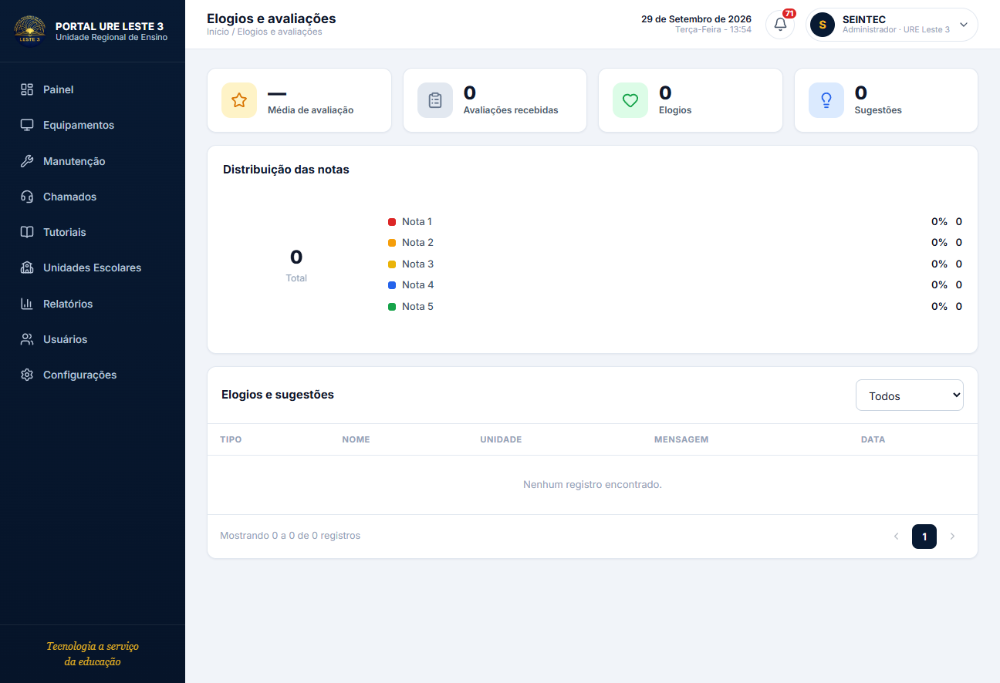

> Item do menu **Elogios e Avaliações**, visível só para a matriz. O backend
> exige `ADMIN` ou `TECNICO` nas três rotas (`GET /feedback`,
> `GET /feedback/stats`, `GET /feedback/avaliacoes`); a escola não vê nem os
> números nem a caixa de retorno.
>
> O comentário da avaliação era gravado desde o começo mas **ninguém da matriz
> conseguia ler** — só quem abriu o chamado, em `/consulta`. A rota
> `/feedback/avaliacoes` existe para fechar essa lacuna.

---

## `/configuracoes` — Configurações *(ADMIN)*

Sete abas, navegação lateral sticky.

### 1 · Catálogo de equipamentos

Formulário inline (categoria / marca / modelo) que alimenta a cascata do
formulário público. Tabela paginada de 8 em 8, com filtro local e remoção.

### 2 · Status do parque

Barras de distribuição do inventário por status, ordenadas da maior para a
menor.

### 3 · Formulário de chamados

Gerencia as categorias e perguntas do formulário público.

- Lista de categorias, cada uma **expansível** para mostrar as perguntas.
- Cada pergunta mostra: número de ordem, rótulo, chip de tipo (*Opções* /
  *Texto* / *Texto longo*), badge *Obrigatória*, badge *Condicional* e badge
  *Inativa*.
- Reordenar perguntas usa as setas ↑ ↓ (troca o campo `ordem` entre vizinhas).
- Excluir uma categoria **apaga todas as perguntas dela** — o diálogo de
  confirmação avisa explicitamente.

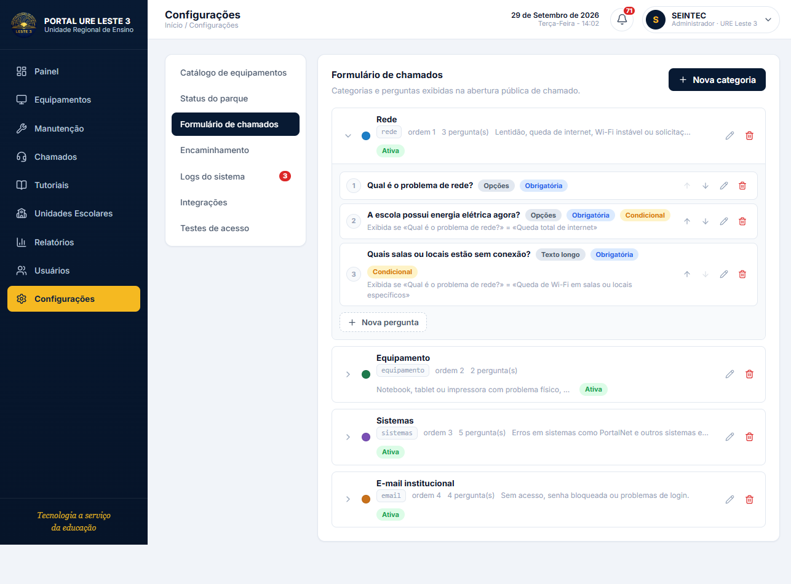

Repare nas três perguntas da categoria **Rede**: a primeira é obrigatória, e as
duas seguintes carregam o badge *Condicional* com a condição escrita por extenso
(`Exibida se «Qual é o problema de rede?» = «Queda total de internet»`). É
literalmente a configuração que produz as perguntas condicionais do print 04.

**Editor de pergunta** — rótulo, texto de ajuda, tipo, ordem, obrigatória, ativa,
condicionalidade (qual pergunta da **mesma categoria** de tipo Opções libera
ela, e qual opção exata) e o editor de opções (cada opção pode ter rótulo, ordem
e um alerta com texto, tipo, link e as flags `encerra` / `exigeAnexo`).

### 4 · Encaminhamento

Uma linha por categoria do formulário, com o destino (Técnico da unidade ou um
técnico fixo), um switch **Ativo/Inativo** e o botão de excluir a regra.

O select de técnico fixo segue a mesma **escala de atendimento** do modal de
encaminhamento do chamado (ver abaixo) — a categoria *Sistemas* e *E-mail*
aceitam só as cinco pessoas que atendem esse tipo de chamado.

O botão **"Aplicar agora aos abertos"** roda as regras ativas sobre os chamados
já abertos **sem responsável** — útil quando as regras foram criadas depois.
Retorna quantos foram encaminhados e quantos ficaram sem técnico.

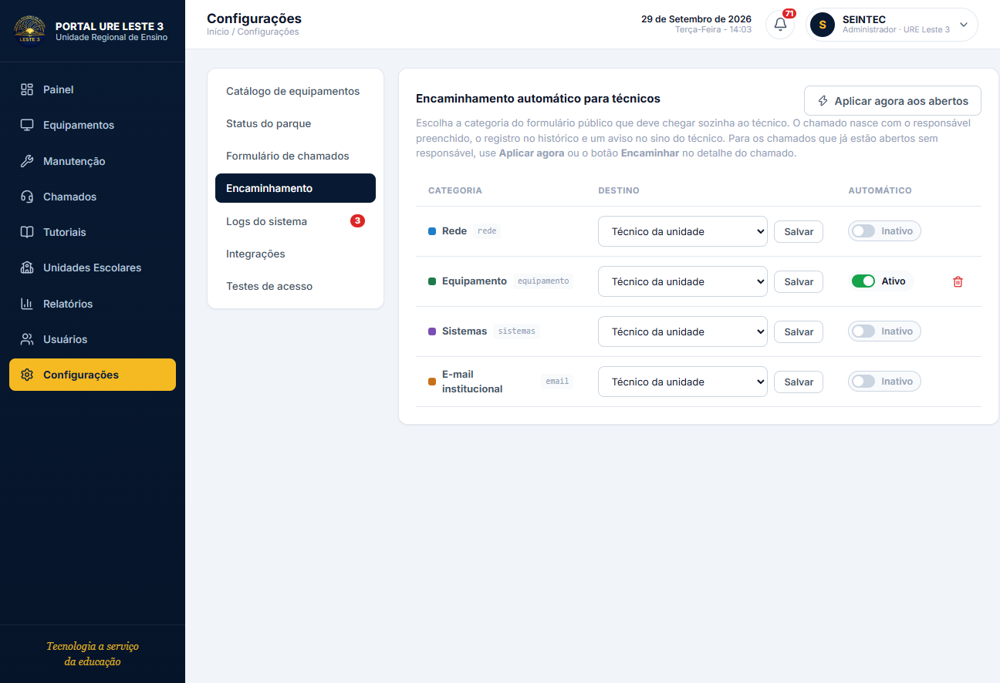

> Repare que a regra da categoria *Equipamento* está **Ativa** (switch verde) e
> as outras três **Inativas** — é o estado normal de um sistema onde só uma
> categoria foi configurada até agora.

> Regras **nascem desativadas** (`ativa: false` no banco). Criar a regra não a
> liga: é preciso ativar o switch de propósito.

#### A escala de atendimento

Quem pode ficar com um chamado não vem solto do cadastro de usuários: é a
escala fixa de `src/utils/tecnicos.ts`, e a **ordem da lista é a ordem do
select**.

| Categoria do chamado | Equipe (nesta ordem) |
|---|---|
| Todas, exceto Sistemas/E-mail | PABLO, FERNANDA, MATHEUS, JESSICA, FABIO, JOAO, GUILHERME, JOSEMIR, VALDEIR, CHARLES, CAROL, HEBERT |
| **Sistemas** e **E-mail** | JESSICA, MATHEUS, PABLO, FERNANDA, FABIO |

No modal do chamado, quem atende a unidade vem sempre em primeiro (optgroup
"Atende esta unidade"); nas categorias restritas, o técnico da unidade só
aparece se estiver entre os cinco — caso contrário some da lista e a tela avisa
que ele não atende aquele tipo de chamado.

O casamento entre o nome cadastrado no backend e o nome da escala é pelo
**primeiro nome**, sem acento e sem diferenciar maiúsculas/minúsculas
("Carolina Prado" entra como CAROL, "Heberto" como HEBERT). Técnico ativo fora
da escala não some do select: nas categorias comuns ele vai para o fim da
lista; em Sistemas/E-mail sai da lista, a não ser o técnico que já estava
salvo na regra.

### 5 · Logs do sistema

Duas seções:

**Erros dos backends** — alimentada pelos interceptors de axios. Mostra data,
backend (Chamados / SCE), requisição (método + rota), status e mensagem. Erros
repetidos em sequência são **agrupados** com um contador `×N`, e a mensagem
expande ao clicar. Botão "Limpar".

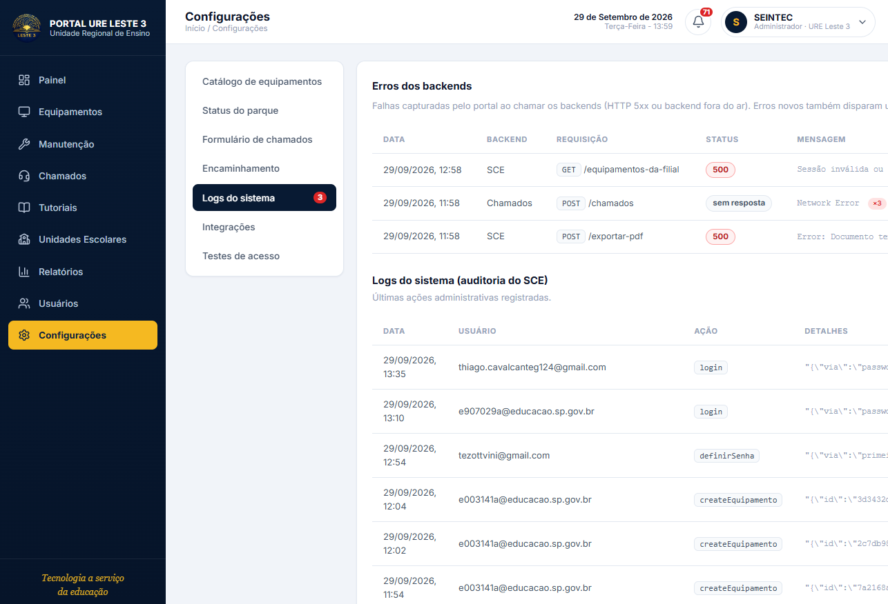

> Neste print as três entradas de "Erros dos backends" são **exemplo**, inseridas
> só para ilustrar o agrupamento. Elas mostram as três situações mais comuns:
> sessão expirada no SCE (HTTP 500, repetido 12×), backend sem resposta
> (`Network Error`, 3×) e erro de exportação.

**Auditoria do SCE** — as últimas 80 ações administrativas registradas pelo
equipamentos (usuário, ação e detalhes em JSON).

Ver [Tratamento de erros](./09-tratamento-de-erros.md) para entender como esse
log é gerado.

### 6 · Integrações

Três cartões que testam a conexão:

| Cartão | Teste | Critério |
|---|---|---|
| Backend — Chamados | `GET /dashboard/stats` | Responde |
| Backend — Equipamentos (SCE) | `GET /unidades-resumo` | Responde |
| Login único (SSO) | derivado | Ambos acima OK |

Botão **Testar agora**. Não emite toasts — o resultado é só visual.

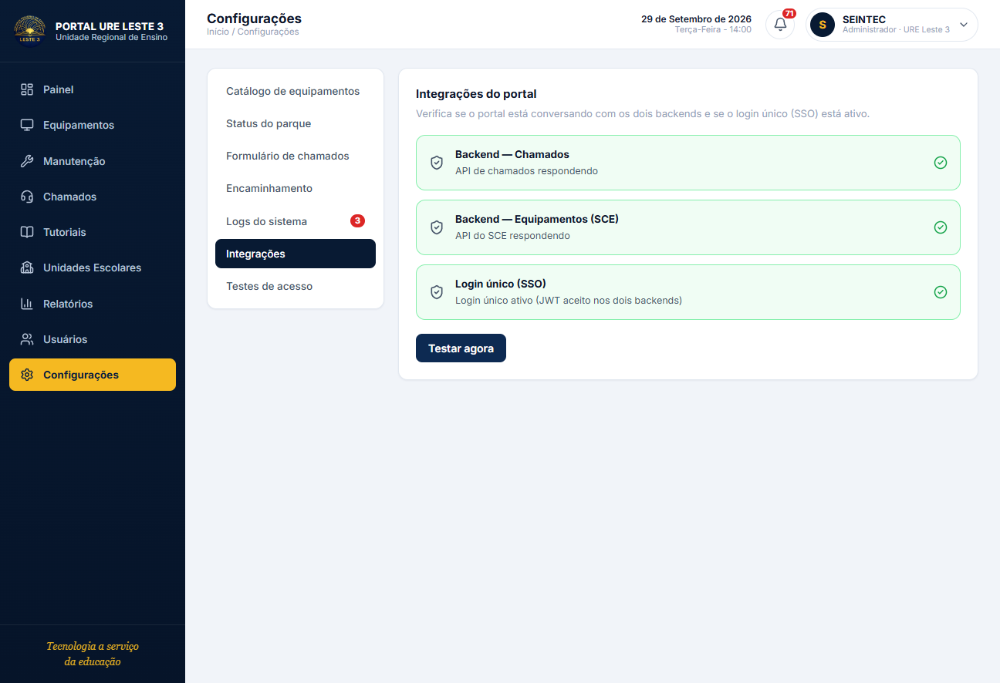

> É a **primeira coisa a checar** quando alguém relata "os equipamentos não
> carregam mas os chamados aparecem".

### 7 · Testes de acesso *(somente desenvolvimento)*

Três botões que simulam Gestor, Técnico ou Visualizador. Explicação de que só a
interface muda.

> ⚠️ **Esta aba não existe no build de produção.** A lista de abas é montada
> condicionalmente a `auth.simulacaoAtivavel` (`import.meta.env.DEV`), e
> `simularComo()` é um no-op fora do dev. Em produção o simulador levava o
> usuário a crer que trocar perfil era uma função real de autorização — e
> escondia bugs em que o menu sumia para o perfil errado sem o backend recusar
> nada.

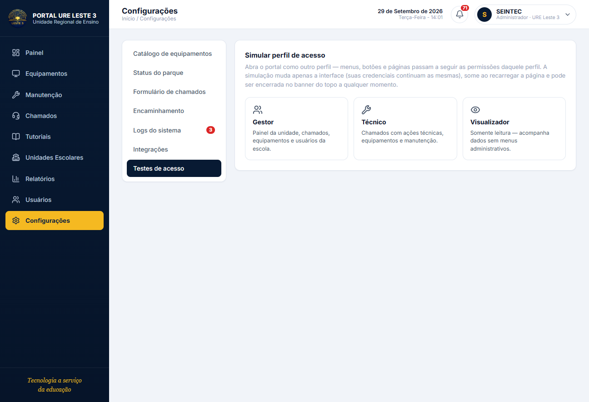

---

Ver também: [Arquitetura](./02-arquitetura.md) ·
[Backends e endpoints](./06-backends-e-endpoints.md) ·
[Tratamento de erros](./09-tratamento-de-erros.md)
