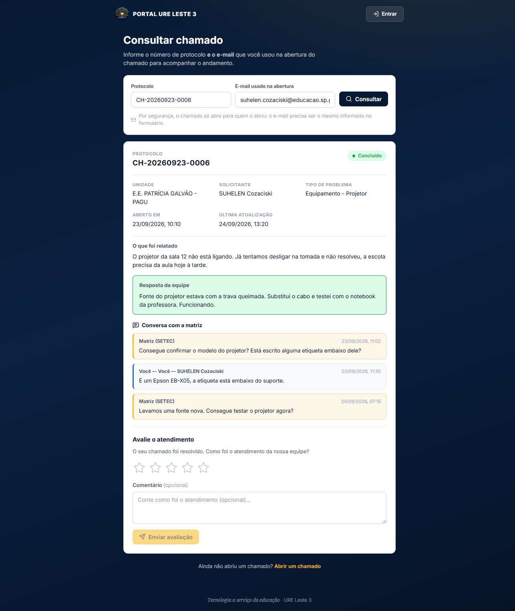
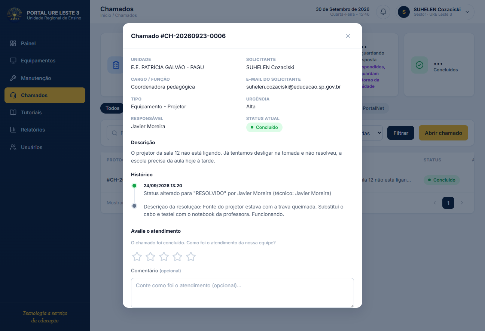
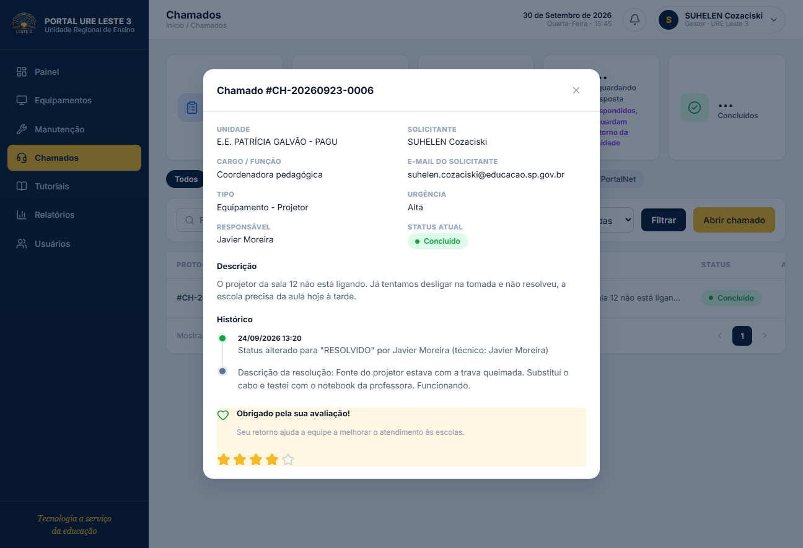
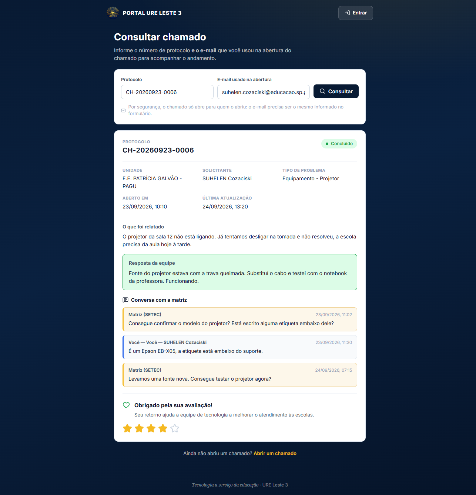
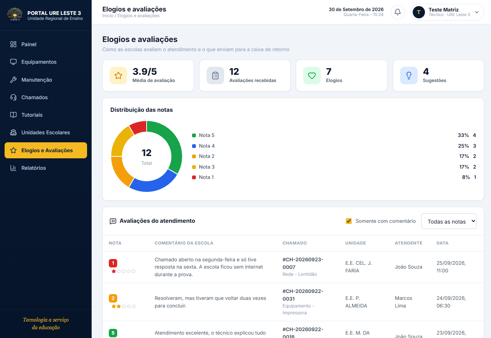

# 13 · Avaliação de atendimento

Como a escola avalia um chamado depois que ele é concluído, e como a equipe da
matriz enxerga essas notas. Este documento acompanha o caminho **inteiro**:
do fechamento do chamado até o comentário aparecendo na tela da matriz.

---

## Resumo em 30 segundos

- Quem avalia: **a escola que abriu o chamado**, sem login, pela tela
  `/consulta` usando **protocolo + e-mail**.
- Quando: **só depois que o chamado vira `RESOLVIDO`**. A avaliação não existe
  antes disso.
- O que a escola dá: **nota de 1 a 5 estrelas** + **comentário opcional**
  (até 1000 caracteres).
- Quantas vezes: **uma por chamado**. A segunda tentativa devolve `409`.
- Quem lê: a matriz, em `/feedback`, na tabela *"Avaliações do atendimento"*.

---

## O momento em que a avaliação aparece

Este é o ponto central do fluxo, e ele é **automático** — ninguém precisa
avisar a escola.

```
Chamado aberto
      │
      ▼
… ATENDIMENTO, PERGUNTAS E RESPOSTAS …
      │
      ▼
Status muda para RESOLVIDO          ← o gatilho
      │
      ├──► sino da escola: "Chamado CH-… concluído"
      │
      ▼
/consulta faz polling de 30 s
      │
      ▼
A tela recebe o status novo → bloco de avaliação se materializa
```

### 1. O fechamento é sempre da escola, e passa pela conferência

Com o fluxo de atendimento, **quem muda para `RESOLVIDO` é a conferência** —
não o técnico e não a matriz:

| Quem | O que faz | Como |
|---|---|---|
| **Técnico** (ou ADMIN) | **conclui o atendimento** → `AGUARDANDO_CONFERENCIA` | `POST /chamados/:id/concluir` |
| **Escola** (GESTOR/VISUALIZADOR) | **confirma** → `RESOLVIDO` | `POST /chamados/:id/conferir` com `{aprovado:true}` |
| **Escola** | **contesta** → volta para `ABERTO` | `POST /chamados/:id/conferir` com `{aprovado:false, texto}` |

A escola não mexe mais no status por `PATCH /chamados/:id/status`: essa rota
recusa com `403` para `GESTOR`/`VISUALIZADOR` e aponta a conferência. O motivo
é que "a escola só pode concluir" permitsia que ela fechasse um serviço que o
técnico **nunca concluiu** — não havia conferência nenhuma nesse caminho.

A restrição continua valendo no `PATCH`: quem é matriz pode corrigir status
fora do fluxo (erro de encaminhamento, chamado encerrado por decisão do setor),
mas com a descrição da resolução obrigatória.

No momento da conclusão o backend grava:

- `tecnicoResolucao` — quem atendeu
- `descricaoResolucao` — o que foi feito
- `concluidoEm` — quando
- uma **atividade** do tipo `CONCLUSAO` (a linha do tempo do atendimento)
- uma linha no `historico`

E avisa a unidade no sino (com o texto da conclusão) e por e-mail.

Na conferência aprovada, grava `conferidoEm`/`conferidoPor`, uma atividade
`APROVACAO` (se houver comentário) e **avisa o técnico responsável** que o
serviço foi validado.

> **Avaliar exige conferência.** No modal, `podeAvaliar` exige `conferidoEm`
> preenchido — não só `status === 'RESOLVIDO'`. É a diferença entre "terminado"
> e "terminado e verificado por quem pediu".

### 2. A tela `/consulta` descobre sozinha

Não há push nem e-mail com link de avaliação. A tela de consulta já está
aberta na mão da pessoa e faz **polling a cada 30 s**
(`AUTO_REFRESH_MS.rapido`, em `useAutoRefresh`).

A cada rodada a função `reconsultar()` chama
`GET /chamados/protocolo/:protocolo?email=` de novo. Quando a resposta passa a
trazer `status: "RESOLVIDO"`, o `computed` `resolvido` muda para `true` e o
bloco de avaliação entra na tela.

> **Importante:** o polling **não** mexe no formulário de avaliação. Os `ref`s
> de `nota`, `notaHover` e `comentario` são independentes do `resultado`, então
> uma nota que a pessoa começou a preencher não é apagada por uma reconsulta.
> Falha de polling também é silenciosa: a tela continua mostrando o que tinha.

### 3. O bloco de avaliação

Aparece abaixo da conversa com a matriz, só se `status === 'RESOLVIDO'`
(`ConsultaProtocoloView.vue`):

```html
<section v-if="resolvido" class="avaliacao">
```

A pessoa vê cinco estrelas (clicáveis, com destaque no `mouseenter`) e um
campo de comentário marcado como *opcional*. O botão **Enviar avaliação** só
libera com pelo menos uma estrela marcada.



> O bloco aparece **sozinho** — não há nem um botão para "avaliar". Quem
> escreveu a regra `v-if="resolvido"` economizou a escola de um passo extra:
> basta a tela estar aberta quando o chamado é concluído.

---

## Onde a escola avalia

Há **dois lugares**, e os dois mostram o mesmo formulário de 5 estrelas.

| Onde | Quem entra | Credencial |
|---|---|---|
| `/consulta` | qualquer pessoa, **sem login** | digita protocolo + e-mail |
| `/chamados` (detalhe) | **GESTOR/VISUALIZADOR**, com login | o e-mail da sessão |

### No painel de chamados

A escola acompanha e conclui o chamado pelo `/chamados`. Ao abrir o detalhe de
um chamado `RESOLVIDO`, o bloco de avaliação aparece abaixo do histórico:



Depois de enviar, o bloco vira o cartão de agradecimento:



**A credencial não é perguntada.** O frontend manda o **e-mail da sessão**
(`auth.user.email`) junto com o protocolo, e o backend continua comparando os
dois — só grava se baterem. Ou seja: **não se libera nada além do que já era
permitido na tela pública**, só se elimina o trabalho de redigitar o e-mail.

Duas consequências que valem registrar:

- Se outra conta abriu o chamado, a sessão não é a dona e o formulário não
  aparece. No lugar há o aviso de que só quem abriu pode avaliar, com a
  indicação de usar a tela de consulta.
- Abrir o chamado por um e-mail e avaliar por outro **não funciona**, nem aqui
  nem na tela pública. É a trava `emailConfere`, a mesma.

> Para o bloco aparecer, o backend precisa devolver `avaliacao` em
> `GET /chamados/:id` — sem isso o painel mostraria o formulário mesmo depois de
> avaliado, e o envio bateria em `409`.

---

## As três situações do bloco

A mesma tela mostra três coisas diferentes, dependendo do histórico:

| Situação | O que aparece |
|---|---|
| Ainda não avaliou | Formulário: 5 estrelas + comentário |
| Enviou agora (nesta sessão) | "Obrigado pela sua avaliação!" com as estrelas preenchidas, e o **Heart** |
| Já tinha avaliado antes | Estrelas em **somente-leitura** + o comentário, entre aspas |

O estado "obrigado" vive em `avaliacaoEnviada` — é **só da sessão**. Se a
pessoa recarregar a página, ela cai no terceiro caso (somente-leitura), porque
a nota agora vem do servidor, em `resultado.avaliacao`.

Depois de enviar, o formulário some e sobra o cartão de agradecimento, com as
estrelas preenchidas e o ícone de coração:



> O cartão é **visual, não é confirmação**: os dados já gravados são os que
> voltam do servidor. Se a pessoa fechar a aba, a nota continua registrada.

---

## As regras do backend

`POST /api/chamados/protocolo/:protocolo/avaliar?email=`
(`avaliarChamadoPublic`, em `chamados.ts`)

| Regra | Resposta se violada |
|---|---|
| Falta o par protocolo + e-mail, ou o e-mail não é válido | `400` |
| Chamado inexistente, excluído, e-mail errado ou chamado legado sem e-mail gravado | `404` — **mensagem idêntica** nos quatro casos |
| Nota não é inteira, ou está fora de 1..5 | `400` |
| Chamado **não** está `RESOLVIDO` | `400` *"Só é possível avaliar chamados concluídos"* |
| Já existe avaliação para esse chamado | `409` *"Este chamado já foi avaliado"* |

Tudo isso em `chamados.ts:222-262`. O comentário é aparado em
`.slice(0, 1000)` e gravado como `null` quando vazio.

### Por que o par protocolo + e-mail

O protocolo é sequencial por dia (`CH-AAAAMMDD-NNNN`), então é adivinhável.
Sem exigir o e-mail da abertura, qualquer pessoa com o número abriria o
chamado de qualquer escola — veria a conversa e poderia avaliá-lo em nome de
outrem. Por isso **a mesma credencial da consulta** vale para avaliar.

O 404 propositalmente ambíguo (`NAO_ENCONTRADO_PUBLICO`) existe pelo mesmo
motivo: mensagens distintas permitiriam enumerar protocolos válidos testando
e-mails.

### Limite de requisição

As rotas `/api/chamados/protocolo*` compartilham um rate limit de **20 req/min**
(`consultaChamadoLimiter`). O polling de 30 s do front consome 2 por minuto
desse balde — e o envio da avaliação mais um.

---

## Modelo de dados

```prisma
model Avaliacao {
  id         String   @id @default(cuid())
  chamadoId  String   @unique   // ← garante UMA avaliação por chamado
  chamado    Chamado  @relation(fields: [chamadoId], references: [id], onDelete: Cascade)
  nota       Int                // 1..5
  comentario String?            // opcional, até 1000 caracteres
  criadoEm   DateTime @default(now())
}
```

O `@unique` em `chamadoId` é a rede de segurança: mesmo que a checagem
aplicativa (`findUnique` antes do `create`) falhe numa corrida, o banco recusa a
segunda avaliação.

---

## Do outro lado: a matriz lendo

`GET /api/feedback/avaliacoes` (matriz: `ADMIN` e `TECNICO`)

Traz a nota **com o comentário**, ligado ao contexto do chamado:

| Campo | Origem |
|---|---|
| `nota`, `comentario`, `criadoEm` | da avaliação |
| `protocolo`, `unidade`, `solicitante`, `tipo` | do chamado |
| `tecnico` | `tecnicoResolucao`, ou `tecnicoSetor` se não houver |

Filtros: `?nota=1..5` e `?somenteComentarios=true`, com paginação. Chamado
excluído (soft delete) não aparece.

Na tela `/feedback` isso vira a tabela *"Avaliações do atendimento"*, com o
checkbox **"Somente com comentário" ligado por padrão** — nota sem texto não
diz o que deu errado, que é o que a equipe precisa para agir.
Junto ficam os agregados de `GET /api/feedback/stats`: média, total e a
distribuição por nota (que vira a rosca). **A média é global** — não existe
média por técnico.

A tela inteira, com os quatro KPIs no topo, a rosca e a tabela:



Repare em três detalhes que só a imagem deixa claros:

- **A nota tem cor, e as estrelas também.** O número usa a mesma paleta da rosca
  (vermelho → verde), então o olho casa a nota da tabela com a fatia do gráfico.
- **O comentário ocupa a coluna mais larga.** É a informação mais valuable da
  tela — protocolo e unidade são só o contexto de quem escreveu.
- **O atendente aparece por linha.** Dá para ler as reclamações e ver quem
  atendeu. Mas a **média é do conjunto todo**: não existe agregado por técnico
  que indique quem precisa de reciclagem.

> O print usa uma **API de mentira** com avaliações fictícias — nenhuma
> avaliação real existe ainda no banco. Ver a nota de rodapé em
> [docs/README](./README.md).

---

## Diagrama do caminho completo

```
 ESCOLA (sem login)                    MATRIZ                    BACKEND
 ───────────────────                   ──────                    ───────

 /consulta
   │ protocolo + e-mail ─────────────────────────────────────────►  GET  /chamados/protocolo/:p
   │◄───────────────────────────────────────────────────────────     status, avaliacao, mensagens
   │
   │ (polling 30 s enquanto aberto)                                  status ≠ RESOLVIDO
   │                                                                → bloco de avaliação NÃO aparece
   │
   │                    ───────►  técnico marca RESOLVIDO ───────────►  PATCH /chamados/:id
   │                                                                     grava técnico + resolução
   │                                                                     notifica a unidade (sino)
   │◄─────────────────────────────────────────────────────
   │ próxima rodada (≤30 s): status = RESOLVIDO
   │
   │ ★★★★★  + comentário
   │ Enviar avaliação ───────────────────────────────────────────────►  POST /chamados/protocolo/:p/avaliar
   │                                                                     valida 1..5, checa duplicidade
   │◄───────────────────────────────────────────────────────────     201 { nota, comentario }
   │ "Obrigado pela sua avaliação!"
   │
   │                                             /feedback ──────►  GET /feedback/avaliacoes
   │                                             tabela com  ◄─────  nota + comentário + chamado
   │                                             os comentários
```

---

## Perguntas que costumam aparecer

**A escola é avisada de que pode avaliar?**
Pelo sino do portal, quando o chamado é concluído. A notificação diz
*"Chamado CH-… concluído"* e leva para a tela do chamado. Não existe e-mail
automático de convite para avaliar.

**Dá para avaliar mais de uma vez?**
Não. A unicidade é do banco (`@unique` em `chamadoId`). Se a pessoa perder a
primeira, precisa falar com a equipe.

**Dá para responder ao comentário?**
Não. O comentário é só de leitura, tanto para a escola quanto para a matriz.
Hoje não existe canal de retorno ao solicitante.

**A nota aparece para o técnico que atendeu?**
Sim, na tabela, em uma coluna. Mas **não** existe agregado por técnico: a
média é do conjunto todo.

**Quem enxerga a avaliação?**
A escola que abriu (na própria `/consulta`) e a matriz (`/feedback`,
`ADMIN` e `TECNICO`). O SCE não tem acesso a avaliações.

---

## Ver também

- [Rotas e telas](./05-rotas-e-telas.md) — o que existe em cada endereço
- [Autenticação e permissões](./04-autenticacao-e-permissoes.md) — a
  credencial pública e por que ela é o par
- [Backends e endpoints](./06-backends-e-endpoints.md) — contrato das rotas
- [Tratamento de erros](./09-tratamento-de-erros.md) — `409` e `400` da
  avaliação (D9 e D10)
