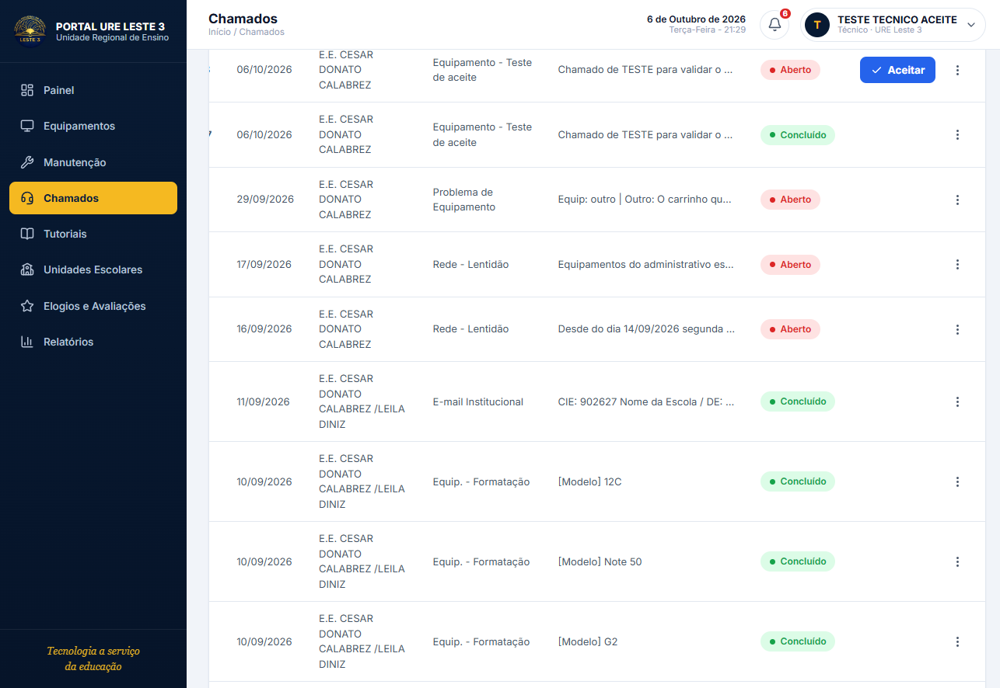
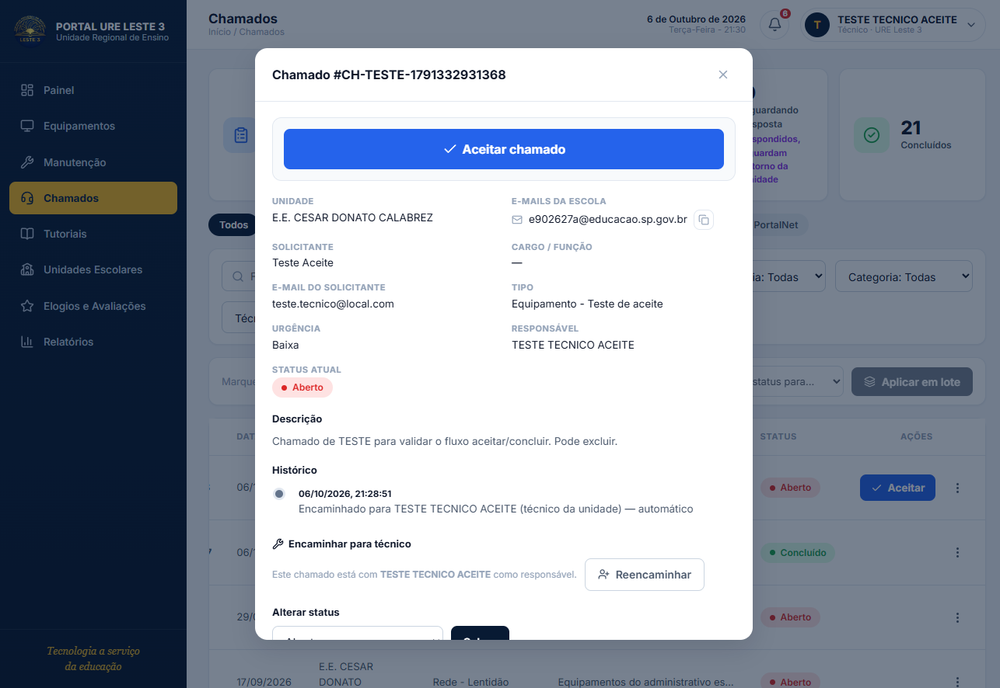
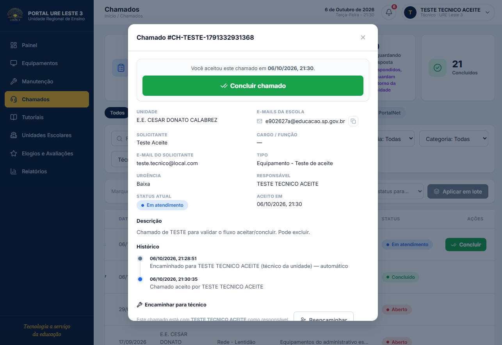
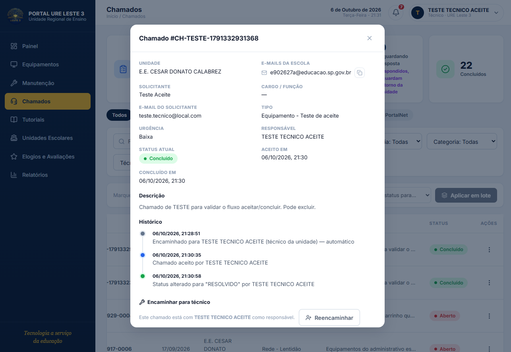

# 14 · Aceite e conclusão pelo técnico

Como um chamado encaminhado vira de fato um atendimento: o técnico **aceita**
pelo portal (com um toque, do celular) e, ao terminar, **conclui** pelo mesmo
caminho. As duas ações gravam **carimbos de horário** no banco (`aceitoEm` e
`concluidoEm`), que permitem medir tempo de resposta e de resolução.

---

## Resumo em 30 segundos

- Quem age: **o técnico (TECNICO) que é o responsável** pelo chamado — o nome
  gravado em `responsavel` pelo encaminhamento precisa ser o dele. O backend
  revalida na hora de gravar.
- O que ele vê: um botão **"Aceitar"** azul ao lado do chamado na lista **e**
  um botão grande **"Aceitar chamado"** no topo do modal de detalhes.
- Ao aceitar: o backend carimba `aceitoEm`, tira o chamado de `ABERTO` para
  `ANDAMENTO` ("Em atendimento") e o botão vira **"Concluir"** (verde).
- Ao concluir: status `RESOLVIDO` + carimbo `concluidoEm`. O detalhe passa a
  mostrar **"Aceito em"** e **"Concluído em"**.
- Reabrir um chamado concluído **zera** o `concluidoEm` — ele deixou de estar
  concluído. Uma nova conclusão grava um novo carimbo.

---

## O fluxo

```
Chamado encaminhado para o técnico          (responsavel = nome do técnico)
      │
      ▼
[Aceitar]  ──►  POST /chamados/:id/aceitar
      │           • aceitoEm = agora
      │           • status: ABERTO → ANDAMENTO
      │           • histórico: "Chamado aceito por <nome>"
      ▼
Em atendimento, botão vira [Concluir]
      │
      ▼
[Concluir] ──►  PATCH /chamados/:id/status  { status: RESOLVIDO }
      │           • concluidoEm = agora (1ª vez; preserva nas seguintes)
      │           • histórico: "Status alterado para RESOLVIDO por <nome>"
      ▼
Concluído — detalhe mostra "Aceito em" e "Concluído em"
```

### Quando cada botão aparece

| Botão | Condição (frontend) |
|---|---|
| **Aceitar** | `TECNICO` logado **é o responsável** + `aceitoEm` vazio + status ≠ `RESOLVIDO` |
| **Concluir** | `TECNICO` logado é o responsável + `aceitoEm` preenchido + status ≠ `RESOLVIDO` |

O ADMIN continua com o fluxo completo pelo select "Alterar status" — os botões
são um atalho pensado para o técnico no celular, não uma troca de permissão.

---

## Onde os botões ficam

**1. Na lista de chamados** — coluna *Ações*, ao lado do chamado, para agir sem
abrir o detalhe:



**2. No modal de detalhes** — bloco no **topo**, com botão de largura total e
altura de toque confortável (52px), difícil de não ver no celular:



Depois do aceite, o bloco mostra o horário em que você assumiu e oferece a
conclusão:



E o chamado concluído guarda os dois carimbos no detalhe e na linha do tempo:



---

## Os carimbos no backend

Campos novos do `Chamado` (migration
`20261006000000_add_aceito_concluido_em`), expostos no tipo compartilhado
`@shared/api`:

| Campo | Tipo | Quando é gravado |
|---|---|---|
| `aceitoEm` | `DateTime?` | Só pelo `POST /chamados/:id/aceitar`. **Nunca** é regravado. |
| `concluidoEm` | `DateTime?` | Na 1ª ida para `RESOLVIDO` (pelo `PATCH /:id/status` **ou** pelo `/batch`). Reabrir zera. |

Duas decisões de desenho:

- **Aceite é idempotente.** Um toque duplo no celular não pode derrubar a ação:
  se o chamado já tem `aceitoEm`, a rota devolve `200` com o chamado como está,
  sem regravar histórico nem datas.
- **Aceitar não desvia a conversa.** Se o chamado está `COMUNICADO` (aguardando
  a escola), o aceite carimba `aceitoEm` mas **mantém o status** — só `ABERTO`
  vira `ANDAMENTO`.

> O carimbo de conclusão vale para **todos** os caminhos de conclusão, não só o
> botão do técnico: a escola concluindo pelo portal e a matriz pelo select de
> status também gravam `concluidoEm`.

---

## Permissões no endpoint

`POST /chamados/:id/aceitar` exige `ADMIN` ou `TECNICO`. Técnico só aceita
chamado **dele** (`responsavel` = seu nome) **ou** de unidade que ele atende —
a mesma regra `tecnicoAtende` das outras rotas. Chamado já `RESOLVIDO` devolve
`422`; inexistente, `404`; escola (GESTOR/VISUALIZADOR), `403`.

---

## Dados de teste

Para ver os botões sem mexer em chamados reais:

| Campo | Valor |
|---|---|
| Usuário | `teste.tecnico@local.com` |
| Senha | `Tec2026..` |
| Perfil | TECNICO · `E.E. CESAR DONATO CALABREZ` |

Os prints deste documento foram capturados com essa conta, contra o backend
local (`localhost:10000`) e o banco real. Os chamados `CH-TESTE-*` são
sintéticos e podem ser excluídos.

---

## Onde mexer

| O quê | Arquivo |
|---|---|
| Rota de aceite + carimbos de status | `chamados/backend/src/routes/chamados.ts` |
| Migration | `chamados/backend/prisma/migrations/20261006000000_add_aceito_concluido_em/` |
| Tipo compartilhado | `chamados/shared/types/api.ts` |
| Cliente HTTP (`aceitarChamado`) | `portal/src/api/chamados.ts` |
| Botões e bloco do modal | `portal/src/views/ChamadosView.vue` |
| Testes do backend | `chamados/backend/src/routes/chamados.test.ts` |
