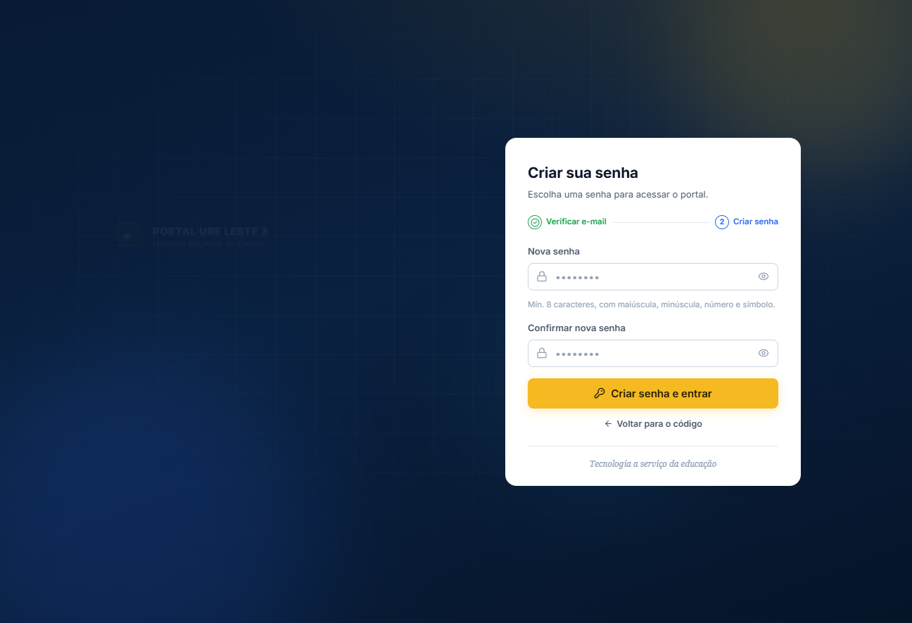
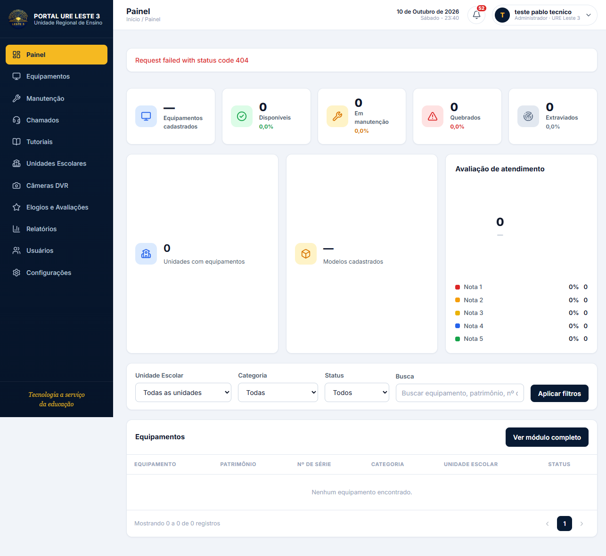

# 15 — Primeiro acesso: código no lugar da senha

> **Status: verificado em execução (10/10/2026).** O fluxo foi testado de ponta a
> ponta com os três serviços no ar: backend de chamados (`:10000`), SCE (`:3000`)
> e portal (`:5173`). O que está escrito abaixo como "verificado" foi observado
> na tela ou na resposta da API — não é leitura de código.

## A pergunta que dá nome a este fluxo

> *No lugar da senha eu coloco o código de acesso?*

**Não.** O código não substitui a senha — ele **libera você criar a sua**. São
etapas separadas, e a pessoa nunca digita a senha de ninguém, nem alguém vê a
dela.

```
1. e-mail   →  o portal pergunta ao backend se a conta está em primeiro acesso
2. código   →  6 dígitos que o ADMIN gerou (expiram em 24 h, uso único)
3. senha    →  no primeiro acesso, a pessoa CRIA a própria senha
```

Nas sessões seguintes é login normal: e-mail + senha.

## Por que não "senha temporária"

Porque são coisas diferentes, com consequências diferentes:

| | Senha temporária | Código de primeiro acesso |
|---|---|---|
| Duração | até alguém trocar | 24 h, **uso único** |
| Vira senha? | sim | **não** |
| O ADMIN sabe a senha? | sim, porque ele gerou | o que ele gera é o **código**, que repassa |
| Reutilizável? | sim | não — e gerar outro **anula** o anterior |
| Esqueceu de novo? | precisa de novo pedido | idem, e o caminho é o mesmo |

O pedido de acesso mora no chamado; a senha nunca passa por lá.

## O caminho percorrido

**1. Quem pede.** Abre `/publico/novo-chamado` e escolhe a categoria de
acesso/senha. O formulário traz o aviso explícito de que a senha **não** deve
ser escrita ali.

**2. O ADMIN responde.** Em `Chamados`, abre o pedido e usa **"Responder com
código de primeiro acesso"** — botão que só aparece para ADMIN da Matriz, em
chamado de recuperação de senha que ainda não foi resolvido. O código é gerado,
**copiado para a resposta do chamado**, e exibido numa caixa para copiar.

**3. A escola lê.** Consulta o chamado pelo número de protocolo, sem precisar de
login, e encontra o código na resposta.

**4. A pessoa entra.** Na tela de acesso, digita o e-mail → o sistema detecta o
primeiro acesso → mostra a etapa do código → cria a senha.

## O que foi verificado em execução

| Verificação | Resultado |
|---|---|
| `POST /api/auth/verificar-email` para conta em primeiro acesso | `{"existe":true,"primeiroAcesso":true,"ativo":true}` |
| Digitando o e-mail, o portal entra sozinho na etapa do código | **sim**, sem clicar em nada |
| Tela do código renderiza com os 6 dígitos e as 2 etapas | **sim** |
| Código inválido (`000000`) | **rejeitado** — `400 CODIGO_INVALIDO` |
| Código válido (`717218`) | **aceito**, avança para "Criar sua senha" |
| Criar a senha | **entra no portal** como Administrador |
| Banco guarda só o hash do código | **sim** (`codigoHash`), nunca em claro |

Capturas:



O código de primeiro acesso já foi conferido: a etapa anterior liberou a criação
da senha.



O acesso foi efetivado: menu completo, perfil **Administrador · URE Leste 3**.

## Proteção contra enumeração de contas

`/verificar-email` responde **o mesmo objeto** para e-mail inexistente e para
quem já tem senha — só difere quando a pessoa realmente está em primeiro acesso
e isso vaza porque é o que ela precisa saber para seguir o fluxo.

```
e-mail inexistente  → { existe: true, primeiroAcesso: false, ativo: true }
e-mail cadastrado   → { existe: true, primeiroAcesso: true,  ativo: true }
```

## Quando a verificação falha

Se o backend não responde, o portal **não trava** a pessoa: ela segue para a
etela de senha e tenta o login normal. Mas agora aparece um aviso dizendo que a
verificação não aconteceu, com o atalho **"Já tenho um código"** — que leva
direto à etapa do código.

O atalho funciona porque o código **não depende** dessa verificação: o backend
valida o código ao confirmar, não na etapa 1.

Ver [a correção em `09-tratamento-de-erros.md`](./09-tratamento-de-erros.md).

## Limite conhecido

Este fluxo cobre **primeiro acesso**. Para quem **já tem senha e a esqueceu**,
o caminho é o de sempre (pedir redefinição) e **não foi construído aqui**. Se
esse for o seu caso, é outra task.

## Como testar de novo

```bash
cd chamados/backend && npm run dev     # :10000
cd portal && npm run dev               # :5173
```

Depois, com uma conta em primeiro acesso:

1. `POST /api/auth/admin/gerar-codigo-primeiro-acesso` (como ADMIN) — emite o código
2. Na tela de acesso, digite o e-mail da conta
3. A etapa do código deve aparecer sozinha
